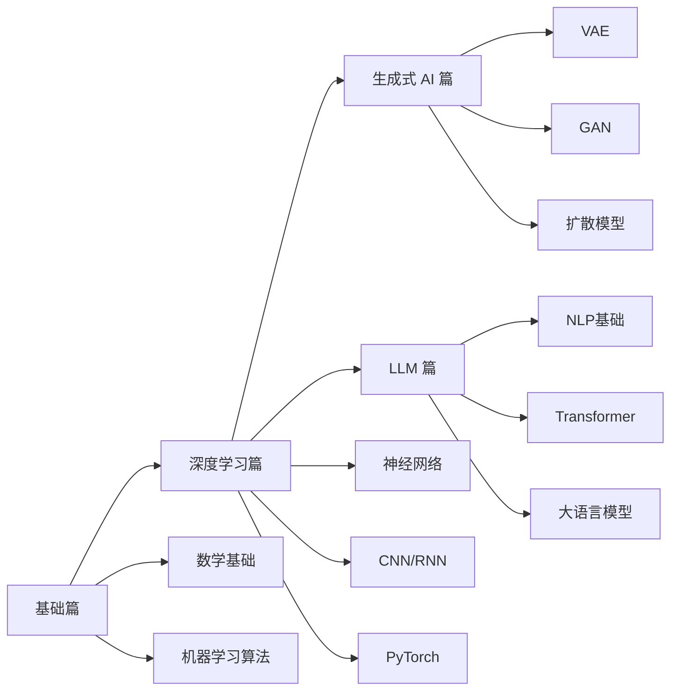

# HAPPY-AI 机器学习与深度学习教程

<p align="center">
  
</p>

<p align="center">
  <strong>从零到一，系统掌握 AI 核心技术</strong>
</p>

<p align="center">
  <a href="#快速开始">快速开始</a> •
  <a href="#学习路线">学习路线</a> •
  <a href="#目录结构">目录结构</a> •
  <a href="#技术栈">技术栈</a> •
  <a href="#贡献指南">贡献指南</a>
</p>

---

## 项目简介

HAPPY-AI 是一套系统性的机器学习与深度学习教程，涵盖从数学基础到前沿大语言模型的完整学习路径。教程采用理论与实践相结合的方式，每个知识点都配有可运行的代码示例，帮助学习者真正掌握 AI 技术。

### 教程特色

- **零基础友好**：不需要预先掌握复杂的数学知识，用到什么讲什么
- **代码驱动**：每个知识点都配有可运行的代码示例
- **由浅入深**：从线性回归到大语言模型，循序渐进
- **实战导向**：结合真实案例和项目，学以致用
- **持续更新**：紧跟 AI 领域最新进展

## 学习路线



### 四大模块

| 模块 | 章节 | 内容概要 |
|------|------|----------|
| **基础篇** | 01-10 | 数学基础、Python 工具、经典机器学习算法 |
| **深度学习篇** | 11-20 | 神经网络、CNN、RNN、PyTorch 实战 |
| **生成式 AI 篇** | 21-24, 40 | VAE、GAN、扩散模型、Stable Diffusion |
| **LLM 篇** | 25-39 | NLP、Transformer、预训练、微调、RAG、Agent |

## 快速开始

### 环境要求

- **Node.js** >= 18.0.0
- **pnpm** >= 8.0.0（推荐）或 npm/yarn

### 安装步骤

```bash
# 1. 克隆仓库
git clone https://github.com/your-username/happy-ai.git
cd happy-ai

# 2. 安装依赖
pnpm install

# 3. 启动开发服务器
pnpm dev
```

访问 http://localhost:3000 查看教程网站。

### 构建部署

```bash
# 构建生产版本
pnpm build

# 预览构建结果
pnpm start
```

## 目录结构

```
happy-ai/
├── content/
│   └── docs/                    # 教程内容
│       ├── foundations/         # 基础篇 (01-10)
│       ├── deep-learning/       # 深度学习篇 (11-20)
│       ├── generative-ai/       # 生成式 AI 篇 (21-24, 40)
│       └── llm/                 # LLM 篇 (25-39)
├── src/
│   ├── app/                     # Next.js 应用
│   │   ├── (home)/             # 首页
│   │   ├── docs/               # 文档布局
│   │   └── api/                # API 路由
│   ├── components/             # React 组件
│   └── lib/                    # 工具函数
├── public/                     # 静态资源
├── scripts/                    # 工具脚本
└── source.config.ts            # Fumadocs 配置
```

## 技术栈

- **框架**: [Next.js](https://nextjs.org/) - React 全栈框架
- **文档**: [Fumadocs](https://fumadocs.dev/) - 现代文档站点生成器
- **样式**: [Tailwind CSS](https://tailwindcss.com/) - 实用优先的 CSS 框架
- **数学公式**: [KaTeX](https://katex.org/) - 快速数学公式渲染
- **图表**: [Mermaid](https://mermaid-js.github.io/) - Markdown 图表工具
- **部署**: [Vercel](https://vercel.com/) - 零配置部署平台

## 教程内容

### 基础篇 (01-10)

| 章节 | 标题 | 主要内容 |
|------|------|----------|
| 01 | 机器学习概述 | ML 定义、监督/无监督/强化学习 |
| 02 | 线性代数基础 | 向量、矩阵、张量 |
| 03 | 概率与统计基础 | 随机变量、分布、最大似然估计 |
| 04 | Python 与 NumPy | Python 科学计算基础 |
| 05 | 数据预处理 | 数据清洗、特征工程 |
| 06 | 线性回归 | 第一个 ML 算法 |
| 07 | 逻辑回归 | 分类问题经典解法 |
| 08 | 梯度下降 | 核心优化方法 |
| 09 | 模型评估 | 准确率、精确率、召回率、F1 |
| 10 | 过拟合与正则化 | L1/L2 正则化、交叉验证 |

### 深度学习篇 (11-20)

| 章节 | 标题 | 主要内容 |
|------|------|----------|
| 11 | 神经网络基础 | 感知机、多层感知机、前向传播 |
| 12 | 反向传播算法 | 链式法则、计算图、自动微分 |
| 13 | 激活函数 | Sigmoid、ReLU、Tanh、Swish |
| 14 | 卷积神经网络 | 卷积、池化、经典架构 |
| 15 | 循环神经网络 | RNN、LSTM、GRU |
| 16 | 优化算法 | SGD、Momentum、Adam |
| 17 | 批归一化与 Dropout | 加速训练、防止过拟合 |
| 18 | PyTorch 基础 | Tensor、Autograd、DataLoader |
| 19 | 训练技巧 | 权重初始化、早停、数据增强 |
| 20 | 迁移学习 | 预训练模型、微调 |

### 生成式 AI 篇 (21-24, 40)

| 章节 | 标题 | 主要内容 |
|------|------|----------|
| 21 | 深度生成模型 | 生成模型全景图 |
| 22 | 自编码器与 VAE | AE、ELBO、重参数化 |
| 23 | 生成对抗网络 | GAN、WGAN、StyleGAN |
| 24 | 扩散模型入门 | DDPM 基础 |
| 40 | Stable Diffusion | 潜空间扩散、ControlNet |

### LLM 篇 (25-39)

| 章节 | 标题 | 主要内容 |
|------|------|----------|
| 25 | NLP 基础 | NLP 定义、任务分类 |
| 26 | 分词与词向量 | BPE、Word2Vec |
| 27 | RNN 与 Seq2Seq | 编码器-解码器 |
| 28 | 注意力机制 | Scaled Dot-Product、多头注意力 |
| 29 | Transformer | 完整架构解析 |
| 30 | 预训练模型 | BERT、GPT、T5 |
| 31 | 大模型概览 | 规模定律、涌现能力 |
| 32 | 从零搭建 LLM | LLaMA2 实现 |
| 33 | 训练 Tokenizer | BPE/SentencePiece |
| 34 | 预训练 | 数据处理、分布式训练 |
| 35 | 有监督微调 | 指令微调 |
| 36 | PEFT/LoRA | 参数高效微调 |
| 37 | RLHF 对齐 | RLHF、DPO |
| 38 | RAG | 检索增强生成 |
| 39 | Agent | ReAct、Function Calling |

## 参考资料

- [Datawhale 开源社区](https://github.com/datawhalechina) - 优质 AI 教程
- [南瓜书](https://github.com/datawhalechina/pumpkin-book) - 机器学习公式推导
- [蘑菇书](https://github.com/datawhalechina/mushroom-book) - 深度学习教程
- [动手学深度学习](https://zh.d2l.ai/) - 李沐老师教程

## 贡献指南

欢迎贡献！请遵循以下步骤：

1. Fork 本仓库
2. 创建特性分支 (`git checkout -b feature/AmazingFeature`)
3. 提交更改 (`git commit -m 'Add some AmazingFeature'`)
4. 推送到分支 (`git push origin feature/AmazingFeature`)
5. 创建 Pull Request

### 内容贡献规范

- 保持教程风格一致
- 代码示例必须可运行
- 添加必要的注释和说明
- 确保数学公式正确渲染

## 许可证

本项目采用 [MIT 许可证](LICENSE)。

## 联系方式

- **GitHub**: [your-username/happy-ai](https://github.com/your-username/happy-ai)
- **Issues**: [提交问题](https://github.com/your-username/happy-ai/issues)

---

<p align="center">
  如果觉得有用，请给个 ⭐️ 支持一下！
</p>
