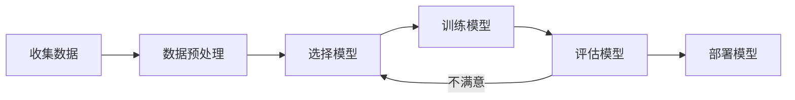

# 01 机器学习概述

## 什么是机器学习

机器学习（Machine Learning）是人工智能的一个分支，它让计算机能够从数据中学习规律，而不需要被显式编程。

> 经典定义：如果一个计算机程序在某项任务 T 上的性能 P，随着经验 E 的增加而提高，则称该程序从经验 E 中学习了关于任务 T 和性能度量 P 的知识。
> —— Tom Mitchell, 1997

### 与传统编程的区别

**传统编程**：
```
规则 + 数据 → 答案
```

**机器学习**：
```
数据 + 答案 → 规则（模型）
```

### 通俗理解

想象一个小孩学认水果：你给他看很多苹果和香蕉的图片，并告诉他哪个是苹果、哪个是香蕉。看多了之后，小孩就能自己分辨没见过的水果了。机器学习同理——计算机从大量"例子"中学习规律，然后对新情况做出判断。

**关键特点**：
- **数据驱动**：模型的能力来自数据，而非人工编写的规则
- **自动学习**：自动发现数据中的模式和规律
- **泛化能力**：目标是能处理**没见过**的新数据

### 实际应用场景

| 应用领域 | 具体例子 | 学习类型 |
|---------|---------|---------|
| 医疗健康 | 根据CT影像诊断肿瘤 | 监督学习（分类） |
| 金融风控 | 预测用户是否会违约 | 监督学习（分类） |
| 推荐系统 | 推荐你可能喜欢的商品 | 监督/无监督学习 |
| 自动驾驶 | 识别道路、行人、交通标志 | 监督/强化学习 |
| 语音识别 | 将语音转换为文字 | 监督学习 |
| 机器翻译 | 将中文翻译成英文 | 监督学习（序列到序列） |

### 机器学习的核心要素

根据Mitchell的定义，机器学习包含三个核心要素：

| 要素 | 含义 | 例子 |
|------|------|------|
| **任务 (T)** | 要解决的问题 | 识别邮件是否为垃圾邮件 |
| **经验 (E)** | 学习所用的数据 | 已标注的邮件数据集 |
| **性能 (P)** | 评估指标 | 分类准确率、精确率 |

### 机器学习的发展历史

**1950s-1960s：萌芽期**
- 1950年：图灵测试提出
- 1957年：感知机（Perceptron）诞生，第一个神经网络
- 1967年：最近邻算法（KNN）提出

**1980s-1990s：理论成熟期**
- 1986年：反向传播算法重新发现
- 1995年：支持向量机（SVM）提出
- 1997年：Tom Mitchell的经典定义

**2000s-2010s：大数据时代**
- 2006年：深度学习重新兴起
- 2012年：AlexNet在ImageNet上取得突破
- 2016年：AlphaGo击败李世石

**2020s-至今：大模型时代**
- 2020年：GPT-3发布，1750亿参数
- 2022年：ChatGPT发布，引发AI应用热潮
- 2024年：多模态大模型（GPT-4V、Sora）

### 常见误区

1. **"机器学习就是人工智能"**：机器学习是AI的一个子集，AI还包括知识图谱、专家系统等
2. **"数据越多越好"**：数据质量比数量更重要，脏数据会导致"垃圾进，垃圾出"
3. **"模型越复杂越好"**：简单的模型往往更鲁棒，奥卡姆剃刀原则——如无必要，勿增实体
4. **"训练准确率高=模型好"**：需要关注泛化能力，防止过拟合
3. **"机器学习能自动解决所有问题"**：需要合适的模型、特征工程和调参
4. **"训练集表现好就是真的好"**：要关注测试集表现，防止过拟合

### 与其他知识点的联系

- **统计学**：机器学习的理论基础，很多算法源自统计方法
- **线性代数**：数据的表示和运算基础（见第02章）
- **概率论**：处理不确定性和随机性（见第03章）
- **优化理论**：模型训练本质是优化问题（见第08章）

## 机器学习的三大类型

### 1. 监督学习（Supervised Learning）

从**带有标签**的数据中学习映射关系。

| 任务类型 | 输出 | 例子 |
|---------|------|------|
| 分类（Classification） | 离散类别 | 邮件是否为垃圾邮件 |
| 回归（Regression） | 连续数值 | 预测房价 |

**核心思想**：给定输入 **X** 和标签 **Y**，学习函数 **f** 使得 $$Y \approx f(X)$$。

### 2. 无监督学习（Unsupervised Learning）

从**没有标签**的数据中发现隐藏结构。

| 任务类型 | 目标 | 例子 |
|---------|------|------|
| 聚类（Clustering） | 发现数据分组 | 客户分群 |
| 降维（Dimensionality Reduction） | 减少特征数量 | 数据可视化 |

### 3. 强化学习（Reinforcement Learning）

通过与**环境交互**学习最优策略。

```
智能体 → 动作 → 环境 → 状态 + 奖励 → 智能体
```

例子：AlphaGo、自动驾驶、游戏 AI。

## 机器学习的工作流程



## 关键术语

| 术语 | 含义 |
|------|------|
| **特征（Feature）** | 描述样本的属性，如房屋的面积、卧室数量 |
| **标签（Label）** | 需要预测的目标值，如房价 |
| **样本（Sample）** | 一条数据记录，包含特征和标签 |
| **数据集（Dataset）** | 所有样本的集合，通常分为训练集、验证集、测试集 |
| **模型（Model）** | 从数据中学习到的规律表示 |
| **训练（Training）** | 用数据调整模型参数的过程 |
| **推理（Inference）** | 用训练好的模型对新数据做预测 |

## 常用工具

- **Python**：机器学习的主流语言
- **NumPy**：数值计算基础库
- **Pandas**：数据处理与分析
- **Scikit-learn**：经典机器学习算法库
- **Matplotlib**：数据可视化

## 小结

- 机器学习让计算机从数据中学习规律
- 三大类型：监督学习（有标签）、无监督学习（无标签）、强化学习（交互奖励）
- 工作流程：数据 → 预处理 → 建模 → 训练 → 评估 → 部署

## 练习

1. 判断以下场景属于哪种学习类型：
   - 根据历史房价数据预测新房价格
   - 将新闻文章自动分类到不同主题
   - 发现购物用户的自然分组
   - 训练机器人走迷宫

2. 列举你日常生活中接触到的机器学习应用（至少3个）。
