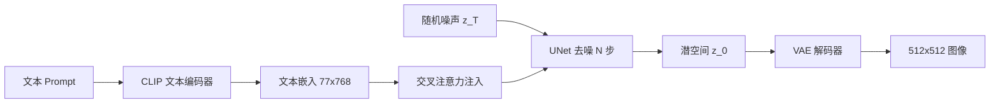
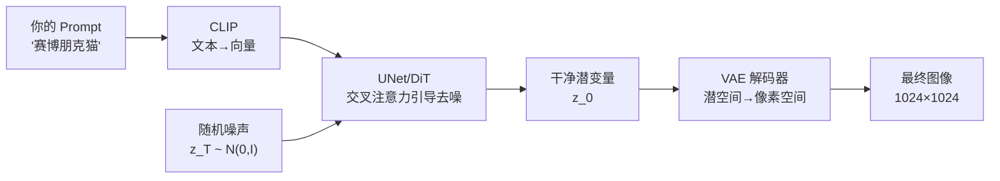

# 40 Stable Diffusion 深度解析

Stable Diffusion（SD）是当今最流行的开源文本生成图像模型。它将扩散模型从像素空间"解放"到潜空间，使得在消费级 GPU 上生成高质量图像成为可能。本章从架构到实践，全面解析 SD 的每一个组件。

> **前置知识**：本章假设你已理解第 24 章的扩散模型基础（DDPM、前向/反向过程、Classifier-Free Guidance）和第 22 章的 VAE 基础。

## 40.1 从 DDPM 到 Stable Diffusion

### 维度灾难：为什么不能在像素空间硬算

当我们惊叹于 Midjourney 或 Stable Diffusion 生成的极致绚丽大作时，首先要理解计算机在底层所面临的数字压力。

一张标准的 $1024 \times 1024$ 像素高清图，在 RGB 三通道下，需要计算和填充近 **300 多万**个浮点数值。**维度灾难（Curse of Dimensionality）** 由此而生：如果直接让深度神经网络在这样一个巨大的欧几里得空间里联合估算每一颗像素的概率分布，计算开销将是毁灭性的，且生成的画面极容易产生局部畸变和语义撕裂。

因此，现代图像生成算法的核心哲学是：**"不要在宏大无序的原始像素画布上硬算，去高度凝练的特征空间里精准雕刻。"**

### DDPM 的局限

第 24 章介绍了 DDPM 的基本原理，但原始 DDPM 有两个关键问题：

1. **像素空间计算量巨大**：对 512×512×3 的图像做扩散，每一步要在 786,432 维空间中操作。使用 1000 步去噪，总计算量约为 $1000 \times 786432$ 维空间的梯度计算，单张图在高端 GPU 上也需要数分钟
2. **无文本条件**：DDPM 只能随机生成，无法根据文字描述生成图像。虽然可以通过 Classifier Guidance 添加条件，但需要额外训练分类器

研究者们尝试了多种加速方案：

| 方案 | 思路 | 局限 |
|------|------|------|
| DDIM（Song 2020） | 确定性 ODE，跳步采样 | 步数减少但仍需 50+ 步 |
| 级联式（Imagen） | 低分辨率 → 超分 | 需要多个模型，训练复杂 |
| **潜空间扩散（LDM）** | **在压缩后的空间做扩散** | **计算量减少 48 倍** ✅ |

**Latent Diffusion Model（LDM）** 的核心创新：将扩散过程从像素空间搬到潜空间（Latent Space），由 Rombach 等人在 2022 年提出。这正是 Stable Diffusion 的基础。

SD 的三大组件：

- **VAE**：将图像压缩到低维潜空间（48 倍压缩），同时保留视觉语义信息
- **CLIP 文本编码器**：将文本 prompt 编码为语义向量，理解人类语言描述
- **UNet**：在潜空间中执行去噪过程，通过交叉注意力接收文本条件引导

> **直觉类比**：如果说 DDPM 是"在高清照片上一层层擦除噪声"，那么 SD 就是"先把照片压缩成缩略图，在缩略图上操作，最后还原为高清"。这就像你不需要在 4K 屏幕上编辑每一个像素，而是先缩小到缩略图进行大幅调整，再放大回原始分辨率。

## 40.2 Stable Diffusion 管线总览

SD 的一次完整推理流程如下：



各组件参数量对比：

| 组件 | SD 1.5 | SDXL | SD3 |
|------|--------|------|-----|
| CLIP 文本编码器 | 123M | 123M + 695M | 123M + 695M + 4.7B |
| UNet / DiT | 860M | 2.6B | 2.0B |
| VAE | 84M | 84M | 84M |
| **总计** | **~1B** | **~3.4B** | **~8B** |

一次推理的计算流程：

1. **文本编码**（~10ms）：CLIP 将 prompt 编码为 77×768 的嵌入矩阵
2. **迭代去噪**（~2-5s，取决于步数）：UNet 在 64×64×4 的潜空间中执行 20-50 步去噪
3. **VAE 解码**（~50ms）：将 64×64×4 的潜变量解码为 512×512×3 的图像

**关键优势**：潜空间尺寸仅为像素空间的 1/48（$64 \times 64 \times 4 = 16384$ vs $512 \times 512 \times 3 = 786432$），UNet 的每步计算量降低约 48 倍。

```python
# 使用 diffusers 库的完整推理流程
from diffusers import StableDiffusionPipeline
import torch

pipe = StableDiffusionPipeline.from_pretrained(
    "stable-diffusion-v1-5/stable-diffusion-v1-5",
    torch_dtype=torch.float16
).to("cuda")

image = pipe(
    prompt="a cyberpunk city at night, neon lights, rain",
    negative_prompt="low quality, blurry",
    num_inference_steps=25,
    guidance_scale=7.5
).images[0]

image.save("cyberpunk_city.png")
**Stable Diffusion**（Rombach 2022）、**SDXL**、**SD3** 都是这种架构。

### 架构归纳：按下 Enter 后的 3 秒

当你在 AI 应用中按下 Enter 键求取图片，短短几秒内在 GPU 里运转的宏大接力如下：

1. **语言翻译解压桥（CLIP / Text Encoder）**：严谨地将人类意图向量化，向视觉界输送指导锚点
2. **雕刻主心骨运算基盘（UNet / DiT 搭配 Flow Matching / Diffusion）**：在高低频潜空间表象上，接受交叉注意力干涉打磨，对杂乱干扰高斯信息进行高并发抽除
3. **压缩映射放大镜（VAE）**：坐镇最后把门，把经过打磨成型的抽象微小特征矩阵极速解压，最终呈现在千万像素级的大显示屏上



## 40.3 VAE 编码器与解码器

SD 的 VAE 是一个卷积自编码器，负责在像素空间和潜空间之间转换（回顾第 22 章的 VAE 基础）。

**空间压缩**：8 倍下采样，4 通道

$$512 \times 512 \times 3 \xrightarrow{\text{Encode}} 64 \times 64 \times 4 \xrightarrow{\text{Decode}} 512 \times 512 \times 3$$

压缩比为 $(512 \times 512 \times 3) / (64 \times 64 \times 4) = 48$ 倍。这意味着 UNet 只需在 16,384 维的潜空间中操作，而非 786,432 维的像素空间。

**SD VAE 的具体架构**：

编码器由一系列 ResNet 块和注意力层组成：

```
输入: 512×512×3
→ Conv 3×3 → 128ch
→ ResBlock + Downsample → 128ch, 256×256
→ ResBlock + Downsample → 256ch, 128×128
→ ResBlock + Downsample → 512ch, 64×64
→ ResBlock → 512ch, 64×64
→ MidBlock (ResBlock + SelfAttn + ResBlock)
→ GroupNorm → Conv 3×3 → 8ch (mu + logvar)
→ 重参数化采样 → 4ch, 64×64
```

解码器是编码器的镜像结构，用上采样（最近邻插值 + 卷积）替代下采样。

**训练目标**：VAE 使用 KL 正则化的重建损失加上感知损失

$$\mathcal{L}_{\text{VAE}} = \|x - \hat{x}\|^2 + \|\phi(x) - \phi(\hat{x})\|^2 + \lambda \cdot D_{KL}(q(z|x) \| p(z)) + \mathcal{L}_{\text{GAN}}$$

其中 $\phi$ 是预训练 VGG 网络的特征提取器（感知损失），$\mathcal{L}_{\text{GAN}}$ 是 patch-GAN 判别器损失。$\lambda$ 取较小值（如 $10^{-6}$），因为潜空间不需要严格的正态分布——UNet 后续会在其中做扩散。

**VAE 瓶颈现象**：由于 48 倍压缩，VAE 解码器在以下场景会丢失细节：

- **高频纹理**：远处的文字、细小图案
- **精确颜色**：RGB 值可能有微小偏移
- **人脸细节**：手指数量、耳朵形状
- **小字文本**：SD 几乎不可能生成可读的小字

这就是为什么 SD 生成的图像有时会出现"手指异常"——部分原因在于 VAE 的信息瓶颈。

```python
# SD VAE 的典型使用方式
from diffusers import AutoencoderKL

vae = AutoencoderKL.from_pretrained(
    "stabilityai/sd-vae-ft-mse"
)

# 编码：像素 -> 潜空间
with torch.no_grad():
    latent = vae.encode(pixel_image).latent_dist.sample()
    latent = latent * 0.18215  # 缩放因子

# 解码：潜空间 -> 像素
with torch.no_grad():
    image = vae.decode(latent / 0.18215).sample
```

> 注意 $0.18215$ 这个缩放因子——它让潜变量的方差接近 1，使扩散过程的噪声调度更稳定。这个值来自训练数据集上潜变量的标准差统计。

- **风格迁移**：输入照片 + "oil painting style"，$s=0.6$

**高分辨率下的 VAE**：当生成 1024×1024 或更大图像时，潜空间变为 128×128×4。此时 UNet 的计算量显著增加，但 VAE 本身不需要改动——它天然支持不同分辨率的输入，因为编码器和解码器都是全卷积的（无全连接层）。

**VAE 的训练与开源**：SD 的原始 VAE 是在 LAION 数据集上与 UNet 联合训练的。后续社区发布了改进版 VAE（如 `stabilityai/sd-vae-ft-mse` 和 `ft-ema`），通过更大的训练数据和更精细的超参数调优，进一步提升了重建质量。推荐使用这些改进版 VAE 替换原始 VAE。

## 40.4 CLIP 文本编码器

CLIP（Contrastive Language-Image Pre-training）是 OpenAI 训练的视觉-语言对齐模型。SD 使用 CLIP 的**文本编码器**（而非视觉编码器）将 prompt 转化为 UNet 能理解的条件向量。

**不同版本的文本编码器**：

| 模型 | 文本编码器 | 输出维度 | 最大 token 数 |
|------|-----------|---------|-------------|
| SD 1.x | CLIP ViT-L/14 | 768 | 77 |
| SD 2.x | OpenCLIP ViT-H/14 | 1024 | 77 |
| SDXL | CLIP ViT-L + OpenCLIP ViT-bigG | 768 + 1280 = 2048 | 77 |
| SD3 | CLIP ViT-L + OpenCLIP ViT-bigG + T5-XXL | 768 + 1280 + 4096 | 77 + 77 + 77 |

**77 个 token 的限制**：CLIP 的文本编码器最大支持 77 个 token（包括 BOS 和 EOS）。超过 77 个 token 的 prompt 会被截断。这就是为什么过长的 prompt 效果不好——后面的内容被丢弃了。

**文本嵌入注入 UNet 的方式**：

文本嵌入不直接参与卷积运算，而是通过**交叉注意力**注入到 UNet 的中间层。具体来说：

1. CLIP 将 77 个 token 编码为 77×768 的矩阵
2. 这个矩阵经过线性投影，作为 K（Key）和 V（Value）传入 UNet 中的交叉注意力层
3. UNet 特征图经过线性投影得到 Q（Query），从而让图像特征"查询"文本语义

```python
# CLIP 文本编码的简化流程
from transformers import CLIPTextModel, CLIPTokenizer

tokenizer = CLIPTokenizer.from_pretrained(
    "stable-diffusion-v1-5/stable-diffusion-v1-5",
    subfolder="tokenizer"
)
text_encoder = CLIPTextModel.from_pretrained(
    "stable-diffusion-v1-5/stable-diffusion-v1-5",
    subfolder="text_encoder"
)

# 文本编码
tokens = tokenizer(
    "a cat sitting on a windowsill",
    padding="max_length",
    max_length=77,
    truncation=True,
    return_tensors="pt"
)
with torch.no_grad():
    text_embeddings = text_encoder(tokens.input_ids)[0]
# text_embeddings 形状: (1, 77, 768)
```

## 40.5 UNet 架构详解

UNet 是 SD 的"心脏"——它执行实际的去噪工作。SD 的 UNet 远比第 24 章展示的基础版本复杂。

**SD UNet 的层级结构**：

```
输入: latent (4ch) + time_emb
│
├─ Down Block 1: ResNet × 2 + Self-Attn + Cross-Attn  → 320ch, 64×64
│   └─ Downsample Conv → 320ch, 32×32
├─ Down Block 2: ResNet × 2 + Self-Attn + Cross-Attn  → 640ch, 32×32
│   └─ Downsample Conv → 640ch, 16×16
├─ Down Block 3: ResNet × 2 + Self-Attn + Cross-Attn  → 1280ch, 16×16
│   └─ Downsample Conv → 1280ch, 8×8
├─ Down Block 4: ResNet × 2                           → 1280ch, 8×8
│
├─ Mid Block: ResNet + Self-Attn + Cross-Attn + ResNet → 1280ch, 8×8
│
├─ Up Block 1: ResNet × 3 + Self-Attn + Cross-Attn    → 1280ch, 16×16
├─ Up Block 2: ResNet × 3 + Self-Attn + Cross-Attn    → 640ch, 32×32
├─ Up Block 3: ResNet × 3 + Self-Attn + Cross-Attn    → 320ch, 64×64
├─ Up Block 4: ResNet × 3                             → 320ch, 64×64
│
└─ 输出: GroupNorm → SiLU → Conv → 4ch latent
```

**核心子模块详解**：

### 时间嵌入

将时间步 $t$ 编码为向量，注入每一层。使用与 Transformer 相同的正弦位置编码：

$$\text{SinusoidalEmb}(t)_{2i} = \sin\left(\frac{t}{10000^{2i/d}}\right), \quad \text{SinusoidalEmb}(t)_{2i+1} = \cos\left(\frac{t}{10000^{2i/d}}\right)$$

随后通过两层 MLP 映射到各层的通道维度，并**加到 ResNet 块的中间激活上**（而非拼接）。

### ResNet 块

每个 ResNet 块的计算流程：

```
x → GroupNorm(32) → SiLU → Conv 3×3
  → + time_emb
  → GroupNorm(32) → SiLU → Dropout → Conv 3×3
  → + skip_connection
```

GroupNorm 替代 BatchNorm，因为扩散模型的 batch size 通常很小。

### Self-Attention

特征图内部的自注意力，捕捉空间长距离依赖。仅在低分辨率层（≤16×16）使用，因为高分辨率层的序列太长（64×64 = 4096 个 token，计算量 $O(n^2)$ 太大）。

### Cross-Attention

文本条件注入的核心，下一节详解。Q 来自图像特征，K/V 来自 CLIP 文本嵌入。

### Skip Connection

每个下采样层的输出与对应上采样层的输入拼接（concatenate），保留空间细节。这正是 U-Net 名字的由来——U 形结构。

**参数量**：

- SD 1.5 UNet：860M 参数（320/640/1280 通道）
- SDXL UNet：2.6B 参数（更大通道数，增加了更多 Attention Transformer 块）

```python
# SD UNet 的核心计算逻辑（简化伪代码）
class SDUNetBlock(nn.Module):
    """UNet 中的一个 ResNet + Attention 块"""
    def __init__(self, in_ch, out_ch, context_dim=768):
        super().__init__()
        self.resnet = ResBlock(in_ch, out_ch)
        self.self_attn = SelfAttention(out_ch)
        self.cross_attn = CrossAttention(out_ch, context_dim)
        self.norm = nn.GroupNorm(32, out_ch)

    def forward(self, x, t_emb, context):
        # context: CLIP 文本嵌入 (B, 77, 768)
        x = self.resnet(x, t_emb)           # ResNet + 时间嵌入
        x = self.self_attn(x)               # 空间自注意力
        x = self.cross_attn(x, context)     # 文本交叉注意力
        return x
```

## 40.6 交叉注意力：文本引导图像

交叉注意力是 SD 中"文本控制图像"的核心机制，也是理解 SD 如何"理解"prompt 的关键。

**关键区别**：在自注意力中 Q、K、V 来自同一输入；在交叉注意力中：

- **Q（Query）**：来自 UNet 特征图（图像侧），形状 $(B, H \times W, C)$
- **K（Key）、V（Value）**：来自 CLIP 文本嵌入（文本侧），形状 $(B, 77, 768)$

$$\text{CrossAttn}(Q_{img}, K_{txt}, V_{txt}) = \text{softmax}\left(\frac{Q_{img} K_{txt}^T}{\sqrt{d_k}}\right) V_{txt}$$

**多头交叉注意力**：SD 使用 8 个注意力头，每头维度 $d_k = C / 8$，最后拼接回 $C$ 维。

**直觉理解**：图像中的每个空间位置"查询"文本中每个词的相关性，然后根据相关性加权获取语义信息。例如：

- prompt："a **red** sports car on a **sandy** beach"
- 图像左上角区域（天空）：主要关注 "beach"、"sandy" 等词
- 图像中间区域（车）：主要关注 "red"、"sports car" 等词
- 图像下方区域（沙滩）：主要关注 "sandy"、"beach" 等词

**注意力图可视化**：

研究者发现，SD 的交叉注意力图能够精确对应 prompt 中的每个词：

- 输入 prompt："a **red** car on a **green** field"
- 注意力图中 "red" 对应区域主要激活在车身上
- "green" 对应区域主要激活在背景草地上

这意味着 SD 真正"理解"了每个词与图像区域的对应关系。

**Prompt 中每个词的影响**：

通过 Prompt-to-Prompt 等技术，研究者可以：

- 交换两个词的注意力图 → 实现属性替换（如 "cat" → "dog"）
- 放大某个词的注意力权重 → 增强该词对应的视觉元素
- 删除某个词的注意力 → 移除对应元素（局部重绘）
- 插值两个 prompt 的注意力图 → 实现平滑的语义过渡

## 40.7 调度器对比

调度器（Scheduler）控制去噪过程的每一步如何从 $x_t$ 计算 $x_{t-1}$。不同调度器在速度和质量之间做不同取舍。

| 调度器 | 步数 | 类型 | 特点 | 适用场景 |
|--------|------|------|------|---------|
| DDPM | 1000 | 随机 | 质量最好但极慢 | 研究用 |
| DDIM | 10-50 | 确定性 | 可跳步，结果可复现 | 通用基线 |
| Euler | 20-30 | 随机 | 简单高效 | 快速原型 |
| Euler Ancestral | 20-30 | 随机 | 更多样，有随机性 | 创意生成 |
| DPM-Solver++ | 15-25 | 确定性 | 高阶 ODE 求解，速度/质量最佳 | **生产首选** |
| UniPC | 10-20 | 确定性 | 最新，少步高质量 | 极速生成 |

**DDIM 的核心思想**：

将随机 SDE 转化为确定性 ODE，使我们可以跳过中间步骤。DDIM 的采样公式：

$$x_{t-1} = \sqrt{\bar\alpha_{t-1}} \cdot \hat{x}_0 + \sqrt{1 - \bar\alpha_{t-1} - \sigma_t^2} \cdot \epsilon_\theta(x_t, t) + \sigma_t \cdot z$$

当 $\sigma_t = 0$ 时为确定性过程（DDIM），当 $\sigma_t = \sqrt{\beta_t}$ 时退化为 DDPM。从 1000 步中均匀选 50 步即可得到不错的结果。

**DPM-Solver++**：使用高阶（二阶或三阶）ODE 求解器，在每步中更精确地估计去噪方向。其核心是将去噪 ODE 离散化为高阶 Taylor 展开：

$$x_{t-\Delta t} \approx x_t - \Delta t \cdot v_\theta(x_t, t) + \frac{(\Delta t)^2}{2} \cdot v_\theta'(x_t, t)$$

20 步就能达到 DDPM 1000 步的质量。

**UniPC**（Unified Predictor-Corrector）：结合了 predictor（预测步）和 corrector（校正步），在极少步数下也能保持高质量。

```python
# diffusers 中切换调度器
from diffusers import (
    DDPMScheduler,
    DDIMScheduler,
    EulerDiscreteScheduler,
    DPMSolverMultistepScheduler,
)

# 只需替换调度器，UNet 不变
scheduler = DPMSolverMultistepScheduler.from_pretrained(
    "stable-diffusion-v1-5/stable-diffusion-v1-5",
    subfolder="scheduler"
)
```

**选择建议**：日常使用推荐 DPM-Solver++ 20 步；需要随机多样性时用 Euler Ancestral；需要精确复现时用 DDIM。

## 40.8 图像到图像 img2img

img2img 不是从纯噪声开始，而是从已有图像的部分加噪版本开始去噪。

**原理**：

1. 用 VAE 编码器将输入图像编码为潜变量 $z_0$
2. 根据 strength 参数 $s$，加噪到第 $s \times T$ 步得到 $z_{sT}$
3. 从 $z_{sT}$ 开始去噪直到 $z_0$
4. VAE 解码得到输出图像

**strength 参数**：

- $s = 0$：完全不加噪，输出与输入相同
- $s = 0.3$：轻微修改，保留大部分原图结构和颜色
- $s = 0.5$：中等修改，保留大致构图但风格可能改变
- $s = 0.7$：大幅修改，仅保留粗略轮廓
- $s = 1.0$：完全不保留原图，等同于 txt2img

```python
# img2img 使用示例
from diffusers import StableDiffusionImg2ImgPipeline

pipe = StableDiffusionImg2ImgPipeline.from_pretrained(
    "stable-diffusion-v1-5/stable-diffusion-v1-5",
    torch_dtype=torch.float16
).to("cuda")

image = pipe(
    prompt="a watercolor painting of a landscape",
    image=input_photo,
    strength=0.6,       # 中等修改
    guidance_scale=7.5,
    num_inference_steps=30
).images[0]
```

**应用场景**：

- **风格迁移**：输入照片 + "oil painting style"，$s=0.6$
- **细节增强**：输入粗糙草图 + 描述，$s=0.5$
- **局部重绘**：结合 inpainting mask 使用

## 40.9 图像修复 Inpainting

Inpainting 是对图像的局部区域进行重新生成，同时保持其余部分不变。

**工作方式**：

1. 用户提供原图 + 二值掩码（mask），标记需要重绘的区域
2. VAE 编码原图得到 $z_0$
3. 在潜空间中，将掩码区域加噪到 $z_T$，保留非掩码区域的 $z_0$
4. UNet 对整体去噪（文本条件描述新内容）
5. 每步去噪后，用原始 $z_0$ 替换非掩码区域，确保与原图一致

**专用 Inpainting 模型 vs 通用模型**：

- **专用模型**（如 runwayml/stable-diffusion-inpainting）：UNet 输入通道扩展为 9ch（4ch 潜变量 + 1ch 掩码潜变量 + 4ch 原图潜变量），效果更好
- **通用模型**：直接用标准 SD + 掩码处理，效果一般但无需额外模型

```python
# Inpainting 使用示例
from diffusers import StableDiffusionInpaintPipeline

pipe = StableDiffusionInpaintPipeline.from_pretrained(
    "runwayml/stable-diffusion-inpainting",
    torch_dtype=torch.float16
).to("cuda")

result = pipe(
    prompt="a cute puppy",
    image=original_image,
    mask_image=mask,          # 白色区域为需要重绘的部分
    num_inference_steps=25
).images[0]
```

**Outpainting**：向外扩展图像边界，本质是 Inpainting 的特殊应用——掩码是图像边缘以外的区域，prompt 描述原图内容的延续。

**Inpainting 的常见陷阱**：

- 掩码边缘太硬 → 生成区域与原图有明显接缝。解决：对掩码做高斯模糊
- 掩码太小 → 模型没有足够空间发挥，效果不自然。建议：掩码区域至少占图像面积的 10%
- prompt 不匹配原图风格 → 生成区域与原图风格不一致。建议：在 prompt 中描述原图的整体风格
- 多次 Inpainting → 累积伪影。建议：每次 Inpainting 后重新编码整个图像

## 40.10 ControlNet

ControlNet（Zhang & Rao 2023）是 SD 最重要的可控生成扩展。它允许用户通过空间条件精确控制生成结果。

**为什么需要 ControlNet**：

文本 prompt 天然是"语义级别"的——你可以描述"一个人站着"，但很难精确控制姿态、构图、透视。ControlNet 解决了这个问题：通过边缘图、深度图、骨骼姿态等空间条件，精确控制生成图像的结构。

**架构设计**：

```
原始 UNet（权重冻结）
    ├─ Encoder Blocks ─→ 复制到 ControlNet（可训练副本）
    │                      每层添加 Zero Conv
    │                      接收空间条件输入（如 Canny 边缘图）
    │                      Zero Conv 输出逐元素加回 UNet 对应层
    └─ Decoder Blocks（正常运行，接收 ControlNet 的注入信号）
```

**Zero Convolution**：权重和偏置初始化为零的 1×1 卷积。这保证：

- 训练初期 ControlNet 不影响原始 UNet 的输出（输出为零）
- 随着训练进行，ControlNet 逐渐学会注入空间条件
- 训练稳定，不会破坏预训练权重

数学上，ControlNet 的注入可以表示为：

$$y_c = \text{ControlNet}(x, t, c) = F(x; \Theta) + Z(F(x + Z(c; \Theta_{z1}); \Theta_c); \Theta_{z2})$$

其中 $Z$ 表示 Zero Convolution，$F$ 是 UNet 的编码器副本，$c$ 是空间条件。

**支持的条件类型**：

| 条件类型 | 预处理器 | 效果 |
|---------|---------|------|
| Canny 边缘 | Canny 边缘检测 | 精确控制轮廓和形状 |
| 深度图 | MiDaS / Depth Anything | 控制 3D 空间结构和透视 |
| 人体姿态 | OpenPose | 控制人物动作和肢体位置 |
| 涂鸦 | 用户手绘草图 | 从粗略草图生成精细图像 |
| 语义分割 | 语义分割模型 | 控制场景中每个区域的内容 |
| 法线图 | Normal Map | 控制表面朝向和光照 |
| 线稿 | Lineart / MLSD | 建筑线稿上色、动漫线稿着色 |

**多 ControlNet 叠加**：可以同时使用多个 ControlNet，例如 Canny（控制轮廓）+ OpenPose（控制姿态），实现更精细的控制。多个 ControlNet 的输出会相加后注入 UNet。

```python
from diffusers import (
    StableDiffusionControlNetPipeline,
    ControlNetModel
)

# 加载 Canny 边缘 ControlNet
controlnet = ControlNetModel.from_pretrained(
    "lllyasviel/control_v11p_sd15_canny"
)
pipe = StableDiffusionControlNetPipeline.from_pretrained(
    "stable-diffusion-v1-5/stable-diffusion-v1-5",
    controlnet=controlnet
)

# 用 Canny 边缘图作为条件
image = pipe(
    "a futuristic city, detailed architecture",
    image=canny_edge_map,
    num_inference_steps=20
).images[0]
```

## 40.11 SDXL

SDXL（Stable Diffusion Extra Large）是 Stability AI 在 2023 年发布的升级版本，在多个维度上全面超越 SD 1.5。

**SDXL vs SD 1.5 对比**：

| 特性 | SD 1.5 | SDXL |
|------|--------|------|
| 默认分辨率 | 512×512 | 1024×1024 |
| UNet 参数 | 860M | 2.6B |
| UNet 通道 | 320/640/1280 | 320/640/1280 + 更多 Transformer 块 |
| 文本编码器 | 1 个 CLIP | 2 个（CLIP + OpenCLIP） |
| 文本嵌入维度 | 768 | 2048 |
| 生成流程 | 单阶段 | 双阶段（Base + Refiner） |
| 微条件 | 无 | 原始尺寸、裁剪位置、目标尺寸 |

**双文本编码器**：

SDXL 同时使用 CLIP ViT-L/14（768 维）和 OpenCLIP ViT-bigG/14（1280 维），将两者的输出拼接得到 2048 维的文本嵌入。这使得 SDXL 对 prompt 的理解更准确，尤其是对复杂描述和长文本的理解能力显著提升。

**Refiner 模型**：

SDXL 采用两阶段生成：

1. **Base 模型**：在潜空间中执行大部分去噪步骤（如 20 步中的前 15 步），生成粗略的结构和语义
2. **Refiner 模型**：在 Base 的潜变量基础上做剩余 5 步去噪，增强细节、纹理和高频信息

这种分治策略让每个模型专注于自己擅长的阶段——Base 负责全局结构，Refiner 负责局部细节——最终图像质量显著提升。

**微条件（Micro-Conditioning）**：

SDXL 额外输入以下信息到 UNet 的时间嵌入中：

- 原始图像尺寸（如 1024×1024）
- 裁剪参数（左上角坐标 $(c_w, c_h)$）
- 目标尺寸

这让模型在训练时能感知不同分辨率和裁剪方式，生成时可以通过调整这些参数控制输出的构图偏好。

```python
# SDXL 两阶段生成
from diffusers import (
    StableDiffusionXLPipeline,
    StableDiffusionXLImg2ImgPipeline
)

# Base 模型
base = StableDiffusionXLPipeline.from_pretrained(
    "stabilityai/stable-diffusion-xl-base-1.0",
    torch_dtype=torch.float16
).to("cuda")

# Refiner 模型
refiner = StableDiffusionXLImg2ImgPipeline.from_pretrained(
    "stabilityai/stable-diffusion-xl-refiner-1.0",
    torch_dtype=torch.float16
).to("cuda")

# Base 生成潜变量
latent = base(
    prompt="a majestic mountain landscape",
    output_type="latent",
    denoising_end=0.8,       # Base 只做前 80% 的去噪
).images[0]

# Refiner 完成剩余去噪
image = refiner(
    prompt="a majestic mountain landscape",
    image=latent,
    denoising_start=0.8,     # Refiner 从 80% 开始
).images[0]
```

## 40.12 SD3 与 DiT

SD3（Stability AI 2024）是 SD 家族的第三次重大升级，用 **DiT（Diffusion Transformer）** 替代了 UNet，标志着扩散模型架构的一次范式转换。

**从 UNet 到 DiT**：

UNet 的卷积结构在处理全局关系时需要多层堆叠，感受野受限于卷积核大小。而 Transformer 的自注意力天然擅长全局建模，每个 token 都能直接与其他所有 token 交互。

DiT（Peebles & Xie 2023）将 Transformer 应用于扩散模型：

- 将 64×64×4 的潜变量分割为 8×8 = 64 个 patch（每 patch 为 8×8×4 的向量）
- 展平为长度 64 的序列，嵌入到 Transformer 的隐藏维度
- 用标准 Transformer Block 替代 UNet 的卷积 + 注意力
- 时间步和条件通过 **AdaLN**（Adaptive Layer Norm）注入

AdaLN 的工作方式：

$$\text{AdaLN}(x, t) = \gamma(t) \cdot \frac{x - \mu}{\sigma} + \beta(t)$$

其中 $\gamma(t)$ 和 $\beta(t)$ 是由时间步 $t$（和条件）通过 MLP 生成的缩放和偏移参数。

**MM-DiT（Multimodal DiT）**：

SD3 使用的架构变体，将文本和图像 token 拼接为一个序列进行联合注意力计算：

$$\text{MM-DiT}(z_{img}, z_{txt}) = \text{Transformer}([z_{img}; z_{txt}])$$

与传统交叉注意力不同，文本和图像 token 在同一个注意力层中**互相可见**，实现更深层的多模态融合。文本 token 不仅影响图像，图像 token 也反过来影响文本表征的更新。

**Flow Matching / Rectified Flow**：

传统 Diffusion 理论华丽，但致命伤是**运算过慢**。因为它依据高度随机的推演，相当于在极其崎岖的迷宫内闭门摸索（随机微分推测），生成一张图通常需要迭代多达 50 步以上。

SD3 全面引入了新的底座核心理论：**流匹配（Flow Matching / Continuous Normalizing Flows）**。

直觉解释：通过最优传输论（Optimal Transport, OT）的极简逻辑引导，模型不再靠纯随机兜圈摸索。**算法被直接约束到一段从源端纯噪声到末端数据目标点之间近似笔直的常微分方程（ODE）平滑矢量轨道之中——不绕路了！** 这使得模型只需要 4 至 8 步即可高速渲染出惊人的画面。

数学上，SD3 放弃了传统的 DDPM 噪声预测，转而学习一个**速度场**（velocity field）$v_\theta(x_t, t)$：

- 定义从噪声 $x_1 \sim \mathcal{N}(0, I)$ 到数据 $x_0 \sim p_{\text{data}}$ 的插值路径：$x_t = (1-t) x_0 + t x_1$
- 真实速度场：$u_t = x_1 - x_0$
- 训练目标：让神经网络预测的速度场 $v_\theta$ 尽量接近真实速度场

$$\mathcal{L}_{\text{FM}} = \mathbb{E}_{t, x_0, x_1}\left[\|v_\theta(x_t, t) - (x_1 - x_0)\|^2\right]$$

优势：轨迹更直（rectified），步数更少即可达到高质量，训练也更稳定。

**三文本编码器**：

SD3 同时使用三个文本编码器：

1. CLIP ViT-L/14（768 维）——快速，捕捉基本语义
2. OpenCLIP ViT-bigG/14（1280 维）——更强的视觉-语言对齐
3. T5-XXL Encoder（4096 维）——最强的纯文本理解能力

T5-XXL 是最大的文本编码器，能捕捉更复杂的语义关系和长距离依赖，但推理时占用约 10GB 显存。实际使用中可以选择禁用 T5 以节省资源，对大多数简单 prompt 影响不大。

## 40.13 SD 生态实用技巧

在实际使用 SD 时，以下技巧能显著提升生成质量：

**负面提示（Negative Prompt）**：

告诉模型"不要生成什么"。原理是 Classifier-Free Guidance 的扩展——将负面 prompt 作为"反向条件"：

$$\hat{\epsilon} = \epsilon_\theta(z_t, t, \text{cond}_{pos}) + w \cdot [\epsilon_\theta(z_t, t, \text{cond}_{pos}) - \epsilon_\theta(z_t, t, \text{cond}_{neg})]$$

常用负面提示模板："low quality, blurry, deformed hands, extra fingers, ugly, distorted"

**Prompt 权重语法**：

- `(word:1.5)`：将 "word" 的嵌入向量缩放 1.5 倍，增强其影响力
- `(word:0.5)`：降低 "word" 的影响力
- `[word]`：等同于 (word:0.91)，轻微降低权重
- `(word:0.0)`：完全忽略该词
- `((word))`：等同于 (word:1.21)——连续括号是指数缩放

**CFG Scale 选择**：

Classifier-Free Guidance 强度 $w$ 的选择直接影响生成结果：

| CFG Scale | 效果 |
|-----------|------|
| 1-3 | 多样但不遵循 prompt，色彩平淡 |
| 5-7 | **推荐范围**，平衡质量和多样性 |
| 7-12 | 高度遵循 prompt，色彩饱和，多样性下降 |
| 15+ | 过饱和、出现伪影和噪点 |

**采样步数选择**：

- DPM-Solver++：20 步即可达到高质量
- Euler：30 步
- DDIM：50 步
- 超过 50 步通常没有明显提升，反而可能引入噪声

**SD LoRA**：

LoRA（回顾第 36 章）可以高效微调 SD，训练特定风格或角色：

- 仅需 20-50 张参考图
- 训练 1-2 小时（单张消费级 GPU）
- 模型文件仅几十 MB（vs 完整模型 4GB+）
- 可叠加多个 LoRA 使用（如风格 LoRA + 角色 LoRA）
- 通过 alpha 参数控制每个 LoRA 的强度

**LoRA 的使用方式**：

```python
# 加载多个 LoRA
pipe.load_lora_weights("path/to/style_lora.safetensors", adapter_name="style")
pipe.load_lora_weights("path/to/char_lora.safetensors", adapter_name="character")

# 设置各 LoRA 的权重
pipe.set_adapters(["style", "character"], adapter_weights=[0.8, 0.6])
```

**其他实用技巧**：

- **Seed 固定**：使用固定随机种子可以复现结果，便于微调 prompt 时对比效果
- **高分辨率修复（Hires. Fix）**：先在低分辨率生成，再用 img2img 放大并增强细节
- **Tiled VAE**：对于超高分辨率图像，将潜空间分块编码/解码，避免显存溢出
- **ADetailer**：自动检测人脸/手部，局部重绘以修复细节问题

## 40.14 小结

**SD 版本对比表**：

| 特性 | SD 1.5 | SD 2.x | SDXL | SD3 |
|------|--------|--------|------|-----|
| 年份 | 2022 | 2022 | 2023 | 2024 |
| 分辨率 | 512² | 512/768² | 1024² | 1024² |
| 去噪网络 | UNet | UNet | UNet | DiT |
| 文本编码器 | 1 CLIP | 1 OpenCLIP | 2 CLIP | 3 CLIP+T5 |
| 训练目标 | \epsilon-pred | v-pred | \epsilon-pred | Flow Matching |
| 开源 | ✅ | ✅ | ✅ | ✅ |

**核心术语速查表**：

| 术语 | 英文全称 | 通俗释义 |
|------|---------|---------|
| 潜空间 | Latent Space | 大幅降低维度的数学分布空间——剥离无关累赘后，只有 AI 画师看得懂的高度浓缩"构图草稿" |
| VAE | Variational Autoencoder | 极其夸张的尺寸极限转换器，承担把亿万像素降维压扁以及把完稿解压放大的关键功能 |
| Diffusion | Diffusion Probabilistic Model | 主流图像特征提取破坏与逆向回归恢复算法，依靠逐步去除随机干扰使图案缓慢成型涌现 |
| CLIP | Contrastive Language-Image Pre-Training | 利用亿万张图文配对进行对比训练，解决语言字符和色彩事物怎么关联挂钩的强力组件 |
| Cross-Attention | 交叉注意力机制 | 图像潜层在计算时以一定权重核对外部语言要求的"照耀映射"工具——你的语言化为手电筒光束，照亮 AI 该着重的局部细节 |
| Flow Matching | 流匹配算法 | 基于最优传输论约束一条平稳确定的直线 ODE 通路，让渲染时间被数百倍节省的核心加速技巧 |
| ControlNet | ControlNet | 在不修改原始模型的前提下，通过空间条件（边缘/深度/姿态）精确控制生成内容的结构 |
| CFG | Classifier-Free Guidance | 用正面和负面 prompt 的差值放大语义方向，控制生成与文本的一致程度 |

**关键要点回顾**：

1. SD 的核心创新是**潜空间扩散**——48 倍压缩使计算成本大幅降低
2. **VAE** 负责像素空间与潜空间的转换，瓶颈效应是细节丢失的根源
3. **CLIP** 将文本转为语义向量，77 个 token 是硬限制
4. **交叉注意力**是文本引导图像的关键机制——Q 来自图像，K/V 来自文本
5. **ControlNet** 通过空间条件实现精确可控生成，Zero Conv 保证训练稳定
6. SDXL 通过更大的模型、双编码器和 Refiner 显著提升质量
7. SD3 用 DiT 替代 UNet，用 Flow Matching 替代 DDPM，代表了最新方向
8. **Flow Matching** 将随机弯路拉直为 ODE 直线，4-8 步即可出图

## 进一步阅读

1. **Rombach et al., 2022.** *High-Resolution Image Synthesis with Latent Diffusion Models.* [arXiv:2112.10752](https://arxiv.org/abs/2112.10752) — Stable Diffusion 原始论文
2. **Zhang et al., 2023.** *Adding Conditional Control to Text-to-Image Diffusion Models.* [arXiv:2302.05543](https://arxiv.org/abs/2302.05543) — ControlNet
3. **Podell et al., 2023.** *SDXL: Improving Latent Diffusion Models for High-Resolution Image Synthesis.* [arXiv:2307.01952](https://arxiv.org/abs/2307.01952) — SDXL
4. **Esser et al., 2024.** *Scaling Rectified Flow Transformers for High-Resolution Image Synthesis.* [arXiv:2403.03206](https://arxiv.org/abs/2403.03206) — SD3
5. **Peebles & Xie, 2023.** *Scalable Diffusion Models with Transformers.* [arXiv:2212.09748](https://arxiv.org/abs/2212.09748) — DiT
6. **Radford et al., 2021.** *Learning Transferable Visual Models From Natural Language Supervision.* [arXiv:2103.00020](https://arxiv.org/abs/2103.00020) — CLIP
7. **Ho & Salimans, 2022.** *Classifier-Free Diffusion Guidance.* [arXiv:2207.12598](https://arxiv.org/abs/2207.12598) — CFG
8. **Datawhale easy-vibe.** *图像生成原理.* [link](https://github.com/datawhalechina/easy-vibe) — 直觉解释与交互式教学
