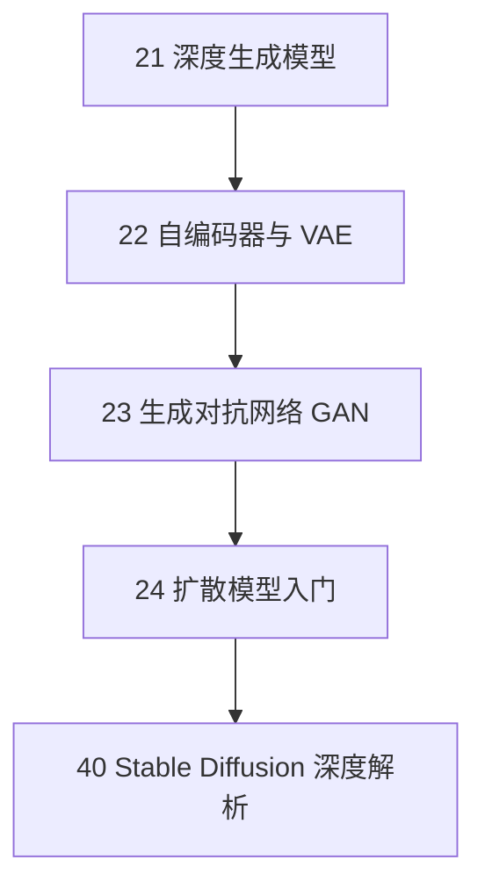

# 生成式 AI 篇：深度生成模型

本部分深入介绍生成式人工智能的核心技术，涵盖变分自编码器（VAE）、生成对抗网络（GAN）、扩散模型（Diffusion Models）以及 Stable Diffusion 等前沿方法。

## 学习路线

## 章节导航

<Cards>
  <Card title="21 深度生成模型" href="/docs/generative-ai/21-generative-models">
    生成模型全景图：自回归、归一化流、VAE、GAN、扩散模型
  </Card>
  <Card title="22 自编码器与 VAE" href="/docs/generative-ai/22-autoencoder-vae">
    AE、ELBO、重参数化、β-VAE、VQ-VAE
  </Card>
  <Card title="23 生成对抗网络" href="/docs/generative-ai/23-gan">
    GAN 训练动态、模式崩溃、WGAN、条件生成
  </Card>
  <Card title="24 扩散模型入门" href="/docs/generative-ai/24-diffusion-models">
    DDPM、潜空间扩散、Stable Diffusion
  </Card>
  <Card title="40 Stable Diffusion" href="/docs/generative-ai/40-stable-diffusion">
    潜空间扩散、文本引导生成、ControlNet
  </Card>
</Cards>
