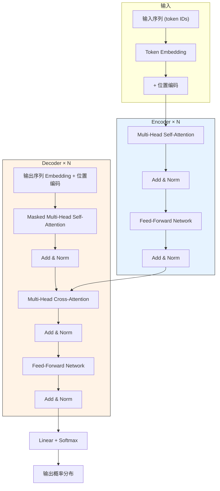
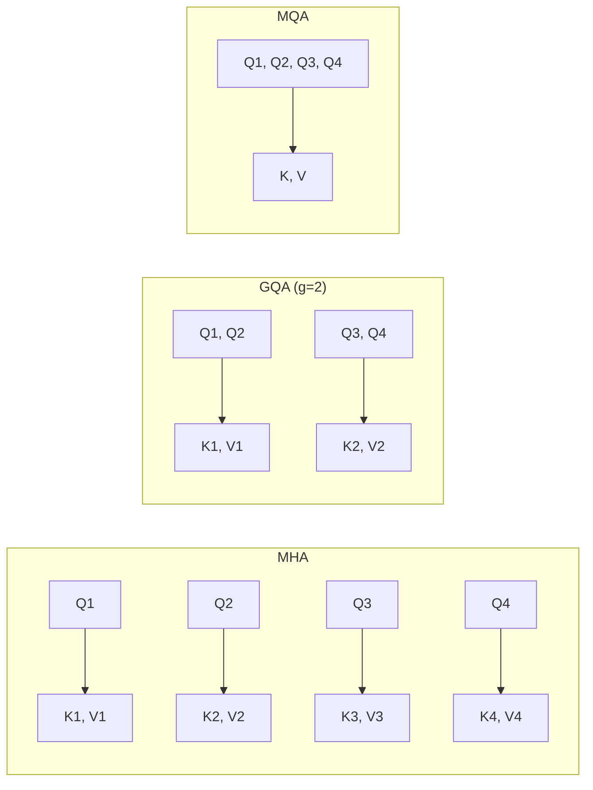

# 29 Transformer 全解析

2017 年，Google 团队发表了划时代的论文 *Attention Is All You Need*，提出了 **Transformer** 架构。它彻底抛弃了 RNN 的顺序计算范式，完全基于注意力机制构建模型，凭借出色的并行能力和长距离依赖建模，成为当今所有大语言模型（LLM）的基石。

本章将从整体架构到每一个组件，再到完整的 PyTorch 实现，带你彻底理解 Transformer。

---

## 29.1 Transformer 总览


Transformer 采用经典的 **Encoder-Decoder** 架构。Encoder 负责"理解"输入序列，Decoder 负责基于 Encoder 的理解"生成"输出序列。



整体数据流可以概括为：

$$\text{Input Tokens} \xrightarrow{\text{Embedding + PE}} \text{Encoder} \times N \xrightarrow{\text{编码表示}} \text{Decoder} \times N \xrightarrow{\text{Linear + Softmax}} \text{Output Tokens}$$

原始 Transformer 的超参数为：$d_{\text{model}} = 512$，$h = 8$（注意力头数），$N = 6$（层数），$d_k = d_v = 64$，FFN 隐层维度 $d_{ff} = 2048$。

---

## 29.2 Embedding 层

### 29.2.1 Token Embedding

Transformer 的输入首先经过 Tokenizer 将文本切分为 token 并映射为整数 ID，再通过 **Token Embedding** 层将离散 ID 转换为连续向量。Embedding 层本质上是一个可训练的查找表，形状为 $(V, d_{\text{model}})$，其中 $V$ 是词表大小。

```python
import torch.nn as nn

# Token Embedding: 将 token ID 映射为 d_model 维向量
token_embedding = nn.Embedding(vocab_size, d_model)
# 输入: (batch_size, seq_len) -> 输出: (batch_size, seq_len, d_model)
```

### 29.2.2 位置编码的必要性

注意力机制是**位置无关**的——"猫追狗"和"狗追猫"在纯注意力计算中完全等价。为了注入序列顺序信息，Transformer 在 Embedding 输出上**叠加**一个位置编码向量：

$$\text{input} = \text{TokenEmbedding}(x) + \text{PositionalEncoding}(\text{pos})$$

下面分别介绍两种经典位置编码方式。

---

## 29.3 正弦/余弦位置编码（原始 Transformer）

原始论文使用固定公式生成位置编码，无需训练：

$$PE_{(\text{pos}, 2i)} = \sin\left(\frac{\text{pos}}{10000^{2i/d_{\text{model}}}}\right)$$

$$PE_{(\text{pos}, 2i+1)} = \cos\left(\frac{\text{pos}}{10000^{2i/d_{\text{model}}}}\right)$$

其中 $\text{pos}$ 是 token 在序列中的绝对位置，$i$ 是维度索引（$0 \le i < d_{\text{model}}/2$）。偶数维用 $\sin$，奇数维用 $\cos$，不同维度对应不同频率的波。

### 直觉理解

把每个位置编码看作一个"时钟"：低维度是快速旋转的秒针，高维度是缓慢旋转的时针。每个位置对应一组独特的 $(\sin, \cos)$ 值，就像钟表上每个时刻的位置都是唯一的。

### 为什么选择三角函数

三角编码有两个关键优势：

1. **可外推**：公式可以计算任意位置的编码，不受训练时最大长度限制。
2. **相对位置可表示**：对于固定偏移 $k$，$PE(\text{pos}+k)$ 可以用 $PE(\text{pos})$ 的线性变换表示，因为 $\sin(a+b) = \sin a \cos b + \cos a \sin b$。

### 数学推导

将二维向量 $[x, y]$ 视为复数 $x + yi$，位置编码可写为：

$$p_m = e^{im\theta} \Leftrightarrow p_m = (\cos m\theta, \sin m\theta)$$

则两个位置的内积为：

$$\langle p_m, p_n \rangle = \text{Re}[p_m \cdot p_n^*] = \cos(m-n)\theta$$

这说明内积仅依赖相对距离 $m-n$，完美编码了相对位置信息。取 $\theta_i = 10000^{-2i/d}$ 并将多组二维编码组合，就得到了完整的高维位置编码。

### PyTorch 实现

```python
import torch
import math

class SinusoidalPositionalEncoding(nn.Module):
    """正弦/余弦位置编码（原始 Transformer）"""
    def __init__(self, d_model, max_len=5000):
        super().__init__()
        # 预计算位置编码矩阵
        pe = torch.zeros(max_len, d_model)
        position = torch.arange(0, max_len).unsqueeze(1).float()
        # div_term = 1 / 10000^(2i/d_model)，用对数形式更稳定
        div_term = torch.exp(
            torch.arange(0, d_model, 2).float() * (-math.log(10000.0) / d_model)
        )
        pe[:, 0::2] = torch.sin(position * div_term)  # 偶数维
        pe[:, 1::2] = torch.cos(position * div_term)  # 奇数维
        pe = pe.unsqueeze(0)  # (1, max_len, d_model)
        self.register_buffer('pe', pe)

    def forward(self, x):
        # x: (batch_size, seq_len, d_model)
        return x + self.pe[:, :x.size(1)]
```

---

## 29.4 RoPE 旋转位置编码（现代 LLM 标配）

原始的正弦位置编码虽然优雅，但在超长序列上泛化能力有限。2021 年，苏剑林提出了 **RoPE（Rotary Position Embedding）**，被 LLaMA、Qwen、Mistral 等现代模型广泛采用。

### 核心思想

RoPE 不在输入端加位置编码，而是**直接在注意力计算中旋转 Q 和 K 向量**。对于位置 $m$ 的 query 向量 $q_m$ 和位置 $n$ 的 key 向量 $k_n$，RoPE 使得它们的内积自然地编码了相对位置 $m-n$：

$$\langle f(q, m), f(k, n) \rangle = g(q, k, m-n)$$

其中 $f$ 是旋转函数，$g$ 是仅依赖相对位置的函数。

### 二维情况

将 $q = (q_0, q_1)$ 看作复数 $q_0 + q_1 i$，RoPE 对位置 $m$ 的向量执行旋转：

$$f(q, m) = q \cdot e^{im\theta} = (q_0 \cos m\theta - q_1 \sin m\theta,\; q_0 \sin m\theta + q_1 \cos m\theta)$$

写成矩阵形式：

$$f(q, m) = \begin{pmatrix} \cos m\theta & -\sin m\theta \\ \sin m\theta & \cos m\theta \end{pmatrix} \begin{pmatrix} q_0 \\ q_1 \end{pmatrix}$$

### 高维扩展

对于 $d$ 维向量，将相邻两维配对，每对使用不同的频率 $\theta_i = 10000^{-2i/d}$，分别旋转。整个旋转矩阵 $R_{\Theta, m}$ 是一个分块对角矩阵，每个 $2\times2$ 块是一个旋转矩阵。

### 为什么 RoPE 优于正弦编码

| 特性 | 正弦位置编码 | RoPE |
|------|------------|------|
| 注入位置 | Embedding 层（加法） | 注意力层（旋转 Q、K） |
| 相对位置 | 间接（通过线性变换） | 直接（内积天然编码） |
| 长序列外推 | 有限 | 配合 NTK-aware 缩放可扩展 |
| 现代 LLM 采用 | 早期模型 | LLaMA、Qwen、Mistral 等 |

### PyTorch 实现

```python
class RotaryPositionalEncoding(nn.Module):
    """RoPE 旋转位置编码"""
    def __init__(self, dim, base=10000):
        super().__init__()
        # 计算频率: theta_i = base^(-2i/dim)
        inv_freq = 1.0 / (base ** (torch.arange(0, dim, 2).float() / dim))
        self.register_buffer('inv_freq', inv_freq)

    def forward(self, seq_len):
        # 返回 cos 和 sin 矩阵，形状 (seq_len, dim)
        t = torch.arange(seq_len, device=self.inv_freq.device).float()
        freqs = torch.outer(t, self.inv_freq)  # (seq_len, dim/2)
        emb = torch.cat([freqs, freqs], dim=-1)  # (seq_len, dim)
        return emb.cos(), emb.sin()

def rotate_half(x):
    """将向量的后半部分取负并拼接到前半部分"""
    x1 = x[..., :x.shape[-1] // 2]
    x2 = x[..., x.shape[-1] // 2:]
    return torch.cat([-x2, x1], dim=-1)

def apply_rotary_pos_emb(q, k, cos, sin):
    """对 Q 和 K 应用 RoPE"""
    # cos, sin: (seq_len, dim) -> (1, 1, seq_len, dim)
    cos = cos.unsqueeze(0).unsqueeze(0)
    sin = sin.unsqueeze(0).unsqueeze(0)
    q_embed = q * cos + rotate_half(q) * sin
    k_embed = k * cos + rotate_half(k) * sin
    return q_embed, k_embed
```

---

## 29.5 Encoder 结构


Encoder 由 $N$ 个相同的 Encoder Layer 堆叠而成，每个 Layer 包含两个子层。

### 29.5.1 Multi-Head Self-Attention

自注意力的核心公式：

$$\text{Attention}(Q, K, V) = \text{softmax}\left(\frac{QK^T}{\sqrt{d_k}}\right)V$$

其中 $Q = XW^Q$，$K = XW^K$，$V = XW^V$，三者均来自**同一个输入** $X$。

**为什么需要除以 $\sqrt{d_k}$？** 当 $d_k$ 较大时，$QK^T$ 的点积值方差会随 $d_k$ 线性增长，导致 Softmax 输出趋近 one-hot，梯度趋近于零。缩放因子 $\sqrt{d_k}$ 将方差稳定在 1 附近。

**多头注意力**将 $d_{\text{model}}$ 维度拆分为 $h$ 个头，每个头独立计算注意力，最后拼接：

$$\text{MultiHead}(Q, K, V) = \text{Concat}(\text{head}_1, \ldots, \text{head}_h) W^O$$

其中 $\text{head}_i = \text{Attention}(QW_i^Q, KW_i^K, VW_i^V)$。

不同头可以学习不同类型的语言关系（如语法依赖、共指关系等）。

```python
import torch
import torch.nn as nn
import torch.nn.functional as F
import math

class MultiHeadAttention(nn.Module):
    """多头自注意力"""
    def __init__(self, d_model, n_heads, dropout=0.1):
        super().__init__()
        assert d_model % n_heads == 0
        self.d_model = d_model
        self.n_heads = n_heads
        self.head_dim = d_model // n_heads

        self.wq = nn.Linear(d_model, d_model)
        self.wk = nn.Linear(d_model, d_model)
        self.wv = nn.Linear(d_model, d_model)
        self.wo = nn.Linear(d_model, d_model)
        self.dropout = nn.Dropout(dropout)

    def forward(self, q, k, v, mask=None):
        batch_size = q.size(0)

        # 线性投影 -> (batch, seq_len, d_model)
        q = self.wq(q)
        k = self.wk(k)
        v = self.wv(v)

        # 拆分多头 -> (batch, n_heads, seq_len, head_dim)
        q = q.view(batch_size, -1, self.n_heads, self.head_dim).transpose(1, 2)
        k = k.view(batch_size, -1, self.n_heads, self.head_dim).transpose(1, 2)
        v = v.view(batch_size, -1, self.n_heads, self.head_dim).transpose(1, 2)

        # 缩放点积注意力
        scores = torch.matmul(q, k.transpose(-2, -1)) / math.sqrt(self.head_dim)
        if mask is not None:
            scores = scores.masked_fill(mask == 0, float('-inf'))
        attn = self.dropout(F.softmax(scores, dim=-1))
        context = torch.matmul(attn, v)

        # 合并多头 -> (batch, seq_len, d_model)
        context = context.transpose(1, 2).contiguous().view(batch_size, -1, self.d_model)
        return self.wo(context)
```

### 29.5.2 Add & Norm（残差连接 + 层归一化）

每个子层的输出都经过**残差连接**和**层归一化**：

$$\text{output} = \text{LayerNorm}(x + \text{Sublayer}(x))$$

**残差连接**的核心价值：在反向传播中，$\frac{\partial y}{\partial x} = 1 + \frac{\partial \text{Sublayer}}{\partial x}$，其中的"1"确保梯度至少以大小 1 回传，防止深层网络梯度消失。

**层归一化**对每个 token 的特征向量独立归一化：

$$y = \frac{x - \mu}{\sqrt{\sigma^2 + \epsilon}} \cdot \gamma + \beta$$

其中 $\mu, \sigma^2$ 是沿特征维度计算的均值和方差，$\gamma, \beta$ 是可学习的缩放和平移参数。与 Batch Norm 不同，Layer Norm 不受 batch 大小影响，适合变长序列。

### 29.5.3 Feed-Forward Network（FFN）

FFN 是每个位置独立的两层全连接网络，内部执行"升维 → 激活 → 降维"：

$$\text{FFN}(x) = \text{ReLU}(xW_1 + b_1)W_2 + b_2$$

中间维度通常是 $d_{\text{model}}$ 的 4 倍（如 512 → 2048 → 512）。

**FFN 为什么是"知识存储"？** 研究发现，FFN 层的权重矩阵实际上存储了大量事实性知识。当模型学到"巴黎是法国的首都"这类知识时，信息主要编码在 FFN 的参数中。注意力层负责"信息路由"（决定哪些 token 交互），FFN 层负责"知识提取"（对每个 token 的表示进行非线性变换和知识检索）。

### 29.5.4 Pre-LN vs Post-LN

原始论文使用 **Post-LN**：先计算子层，再 Add，再 Norm。即 $x = \text{LayerNorm}(x + \text{Sublayer}(x))$。

现代 LLM 普遍使用 **Pre-LN**：先 Norm，再计算子层，再 Add。即 $x = x + \text{Sublayer}(\text{LayerNorm}(x))$。

| 特性 | Post-LN | Pre-LN |
|------|---------|--------|
| 训练稳定性 | 需要 warmup，容易梯度爆炸 | 训练稳定，不需要 warmup |
| 最终效果 | 理论上效果略好 | 效果接近，但更易训练 |
| 主流采用 | 原始 Transformer | GPT、LLaMA 等现代模型 |

---

## 29.6 Decoder 结构


Decoder 同样由 $N$ 个 Decoder Layer 堆叠，但每个 Layer 有**三个**子层，比 Encoder 多了一个 Cross-Attention。

### 29.6.1 Masked Multi-Head Self-Attention

Decoder 的自注意力使用**因果掩码**（Causal Mask），确保位置 $i$ 只能注意到位置 $\le i$ 的 token，不能"偷看"未来信息。掩码是一个下三角矩阵，上三角区域填充 $-\infty$，经 Softmax 后权重为 0。这样模型可以在训练时并行处理整个序列，同时保持自回归特性。

### 29.6.2 Cross-Attention

Cross-Attention 是连接 Encoder 和 Decoder 的桥梁：

- **Query**：来自 Decoder 上一个子层的输出（"我想找什么信息？"）
- **Key, Value**：来自 Encoder 的最终输出（"源序列中有哪些信息？"）

这使得 Decoder 在生成每个 token 时，都能"关注"整个输入序列。

### 29.6.3 Decoder 中的 FFN

与 Encoder 的 FFN 结构完全相同，负责非线性变换和知识提取。

---

## 29.7 完整 Transformer 的 PyTorch 实现

下面我们从零搭建一个完整的 Transformer 模型。

### 29.7.1 组件汇总

首先实现所有基础组件：

```python
import torch
import torch.nn as nn
import torch.nn.functional as F
import math

class PositionalEncoding(nn.Module):
    """正弦位置编码"""
    def __init__(self, d_model, max_len=5000, dropout=0.1):
        super().__init__()
        self.dropout = nn.Dropout(dropout)
        pe = torch.zeros(max_len, d_model)
        position = torch.arange(0, max_len).unsqueeze(1).float()
        div_term = torch.exp(
            torch.arange(0, d_model, 2).float() * (-math.log(10000.0) / d_model)
        )
        pe[:, 0::2] = torch.sin(position * div_term)
        pe[:, 1::2] = torch.cos(position * div_term)
        pe = pe.unsqueeze(0)
        self.register_buffer('pe', pe)

    def forward(self, x):
        x = x + self.pe[:, :x.size(1)]
        return self.dropout(x)


class MultiHeadAttention(nn.Module):
    """多头注意力机制"""
    def __init__(self, d_model, n_heads, dropout=0.1):
        super().__init__()
        assert d_model % n_heads == 0
        self.d_model = d_model
        self.n_heads = n_heads
        self.head_dim = d_model // n_heads

        self.wq = nn.Linear(d_model, d_model)
        self.wk = nn.Linear(d_model, d_model)
        self.wv = nn.Linear(d_model, d_model)
        self.wo = nn.Linear(d_model, d_model)
        self.attn_dropout = nn.Dropout(dropout)

    def forward(self, q, k, v, mask=None):
        batch_size = q.size(0)

        q = self.wq(q).view(batch_size, -1, self.n_heads, self.head_dim).transpose(1, 2)
        k = self.wk(k).view(batch_size, -1, self.n_heads, self.head_dim).transpose(1, 2)
        v = self.wv(v).view(batch_size, -1, self.n_heads, self.head_dim).transpose(1, 2)

        scores = torch.matmul(q, k.transpose(-2, -1)) / math.sqrt(self.head_dim)
        if mask is not None:
            scores = scores.masked_fill(mask == 0, float('-inf'))
        attn = self.attn_dropout(F.softmax(scores, dim=-1))
        context = torch.matmul(attn, v)

        context = context.transpose(1, 2).contiguous().view(batch_size, -1, self.d_model)
        return self.wo(context)


class FeedForward(nn.Module):
    """前馈网络（升维-激活-降维）"""
    def __init__(self, d_model, d_ff, dropout=0.1):
        super().__init__()
        self.linear1 = nn.Linear(d_model, d_ff)
        self.linear2 = nn.Linear(d_ff, d_model)
        self.dropout = nn.Dropout(dropout)

    def forward(self, x):
        return self.linear2(self.dropout(F.relu(self.linear1(x))))


class EncoderLayer(nn.Module):
    """Encoder 层：Self-Attention + FFN"""
    def __init__(self, d_model, n_heads, d_ff, dropout=0.1):
        super().__init__()
        self.self_attn = MultiHeadAttention(d_model, n_heads, dropout)
        self.ffn = FeedForward(d_model, d_ff, dropout)
        self.norm1 = nn.LayerNorm(d_model)
        self.norm2 = nn.LayerNorm(d_model)
        self.dropout = nn.Dropout(dropout)

    def forward(self, x, src_mask=None):
        # Pre-LN: Norm -> Sublayer -> Residual
        normed = self.norm1(x)
        x = x + self.dropout(self.self_attn(normed, normed, normed, src_mask))
        normed = self.norm2(x)
        x = x + self.dropout(self.ffn(normed))
        return x


class DecoderLayer(nn.Module):
    """Decoder 层：Masked Self-Attn + Cross-Attn + FFN"""
    def __init__(self, d_model, n_heads, d_ff, dropout=0.1):
        super().__init__()
        self.masked_self_attn = MultiHeadAttention(d_model, n_heads, dropout)
        self.cross_attn = MultiHeadAttention(d_model, n_heads, dropout)
        self.ffn = FeedForward(d_model, d_ff, dropout)
        self.norm1 = nn.LayerNorm(d_model)
        self.norm2 = nn.LayerNorm(d_model)
        self.norm3 = nn.LayerNorm(d_model)
        self.dropout = nn.Dropout(dropout)

    def forward(self, x, enc_output, src_mask=None, tgt_mask=None):
        # 子层 1: Masked Self-Attention
        normed = self.norm1(x)
        x = x + self.dropout(self.masked_self_attn(normed, normed, normed, tgt_mask))
        # 子层 2: Cross-Attention (Q 来自 Decoder, K/V 来自 Encoder)
        normed = self.norm2(x)
        x = x + self.dropout(self.cross_attn(normed, enc_output, enc_output, src_mask))
        # 子层 3: FFN
        normed = self.norm3(x)
        x = x + self.dropout(self.ffn(normed))
        return x
```

### 29.7.2 组装完整 Transformer

```python
class Transformer(nn.Module):
    """完整的 Transformer 模型"""
    def __init__(self, src_vocab_size, tgt_vocab_size, d_model=512,
                 n_heads=8, n_layers=6, d_ff=2048, max_len=5000, dropout=0.1):
        super().__init__()
        self.d_model = d_model

        # Embedding 层
        self.src_embedding = nn.Embedding(src_vocab_size, d_model)
        self.tgt_embedding = nn.Embedding(tgt_vocab_size, d_model)
        self.pos_encoding = PositionalEncoding(d_model, max_len, dropout)

        # Encoder 和 Decoder 堆叠
        self.encoder_layers = nn.ModuleList([
            EncoderLayer(d_model, n_heads, d_ff, dropout) for _ in range(n_layers)
        ])
        self.decoder_layers = nn.ModuleList([
            DecoderLayer(d_model, n_heads, d_ff, dropout) for _ in range(n_layers)
        ])

        # 最终 LayerNorm（Pre-LN 架构需要）
        self.final_norm = nn.LayerNorm(d_model)

        # 输出头：映射回词表
        self.output_proj = nn.Linear(d_model, tgt_vocab_size)

        # 权重初始化
        self._init_weights()

    def _init_weights(self):
        for p in self.parameters():
            if p.dim() > 1:
                nn.init.xavier_uniform_(p)

    def generate_causal_mask(self, seq_len):
        """生成因果掩码（下三角矩阵）"""
        mask = torch.tril(torch.ones(seq_len, seq_len))
        return mask.unsqueeze(0).unsqueeze(0)  # (1, 1, seq_len, seq_len)

    def encode(self, src, src_mask):
        """编码器前向传播"""
        x = self.src_embedding(src) * math.sqrt(self.d_model)
        x = self.pos_encoding(x)
        for layer in self.encoder_layers:
            x = layer(x, src_mask)
        return x

    def decode(self, tgt, enc_output, src_mask, tgt_mask):
        """解码器前向传播"""
        x = self.tgt_embedding(tgt) * math.sqrt(self.d_model)
        x = self.pos_encoding(x)
        for layer in self.decoder_layers:
            x = layer(x, enc_output, src_mask, tgt_mask)
        return self.final_norm(x)

    def forward(self, src, tgt, src_mask=None, tgt_mask=None):
        # 生成因果掩码
        if tgt_mask is None:
            tgt_mask = self.generate_causal_mask(tgt.size(1)).to(tgt.device)

        # Encoder: 编码源序列
        enc_output = self.encode(src, src_mask)
        # Decoder: 基于编码结果生成目标序列
        dec_output = self.decode(tgt, enc_output, src_mask, tgt_mask)
        # 映射到词表
        logits = self.output_proj(dec_output)
        return logits
```

### 29.7.3 运行测试

```python
# 测试前向传播
model = Transformer(
    src_vocab_size=1000,
    tgt_vocab_size=1000,
    d_model=512,
    n_heads=8,
    n_layers=6,
    d_ff=2048
)

src = torch.randint(0, 1000, (2, 20))  # batch=2, src_len=20
tgt = torch.randint(0, 1000, (2, 15))  # batch=2, tgt_len=15
logits = model(src, tgt)
print(logits.shape)  # torch.Size([2, 15, 1000])
```

输出形状为 `(batch_size, tgt_len, tgt_vocab_size)`，每个位置输出对词表中所有 token 的概率分布。

---

## 29.8 三种架构范式

基于 Transformer 的 Encoder 和 Decoder 组件，衍生出三种主流架构：

### Encoder-Only：BERT（双向注意力）

只使用 Encoder，采用**双向注意力**——每个 token 可以看到序列中所有其他 token。适合**理解**任务（文本分类、命名实体识别、语义相似度）。

预训练方式：Masked Language Model（MLM），随机遮盖 15% 的 token 让模型预测。

### Decoder-Only：GPT（因果注意力，当前 LLM 主流）

只使用 Decoder，采用**因果注意力**——每个 token 只能看到自己和前面的 token。适合**生成**任务，是当前 LLM 的绝对主流架构。

预训练方式：Next Token Prediction，根据前文预测下一个 token。

为什么 Decoder-Only 成为主流？

1. **统一范式**：所有 NLP 任务都可以转化为文本生成任务。
2. **训练高效**：每个 token 都参与损失计算，数据利用率高。
3. **涌现能力**：足够大的 Decoder-Only 模型展现出 Few-shot、CoT 等涌现能力。
4. **KV Cache 友好**：自回归推理可以利用 KV Cache 高效生成。

### Encoder-Decoder：T5（Seq2Seq）

保留完整的 Encoder-Decoder 结构，Encoder 使用双向注意力，Decoder 使用因果注意力 + Cross-Attention。适合 Seq2Seq 任务（翻译、摘要）。

预训练方式：将所有任务统一为 Text-to-Text 格式。

### 三种架构对比

| 特性 | Encoder-Only | Decoder-Only | Encoder-Decoder |
|------|-------------|-------------|-----------------|
| 注意力类型 | 双向 | 因果（单向） | Encoder 双向 + Decoder 因果 |
| 代表模型 | BERT, RoBERTa | GPT, LLaMA, Qwen | T5, BART |
| 典型任务 | 分类、NER、匹配 | 文本生成、对话 | 翻译、摘要 |
| 预训练目标 | MLM | Next Token Prediction | Span Corruption |
| 当前 LLM 主流 | 否 | **是** | 否 |
| Cross-Attention | 无 | 无 | 有 |

---

## 29.9 Transformer 为什么能成功

Transformer 的成功并非偶然，而是多个关键优势的叠加：

### 并行化

RNN 必须按时间步顺序计算，$t$ 时刻的计算依赖 $t-1$ 时刻的输出。Transformer 的自注意力机制使得序列中所有位置可以**同时计算**，充分利用 GPU 的并行能力。训练一个 Transformer 模型比同等规模的 RNN 快数个数量级。

### 长距离依赖

RNN 中，距离为 $k$ 的两个 token 之间需要经过 $k$ 步信息传递，信息会逐步衰减（虽然 LSTM 缓解了这一问题，但未根本解决）。Transformer 中任意两个 token 之间只需**一步**注意力计算即可建立连接，路径长度为 $O(1)$。

### 可扩展性

Transformer 的架构极其适合规模化扩展：

- **宽度扩展**：增大 $d_{\text{model}}$ 和 $d_{ff}$。
- **深度扩展**：增加层数 $N$。
- **数据扩展**：更多训练数据持续提升性能。

Scaling Law 表明，在计算预算固定的情况下，Transformer 的性能随参数量、数据量和计算量的增加而平滑提升。这为 GPT-4、Claude 等千亿参数模型的训练提供了理论基础。

---

## 29.10 现代 Transformer 改进

原始 Transformer 虽然经典，但现代 LLM 已经在多个方面进行了重要改进。

### 29.10.1 Flash Attention（IO 感知的注意力）

标准注意力的瓶颈不在计算，而在**内存读写**。$QK^T$ 需要将 $O(n^2)$ 的注意力矩阵写入 GPU HBM（高带宽内存），成为主要瓶颈。

Flash Attention 的核心思想是**分块计算**（Tiling）：将 Q、K、V 分成小块，在 SRAM（片上缓存）中完成注意力计算，避免将完整的 $n \times n$ 矩阵写入 HBM。

| 特性 | 标准注意力 | Flash Attention |
|------|-----------|----------------|
| 内存复杂度 | $O(n^2)$ | $O(n)$ |
| 计算复杂度 | $O(n^2)$ | $O(n^2)$（不变） |
| 实际速度 | 基准 | 快 2-4 倍 |
| 精度 | 精确 | 近似（误差极小） |

### 29.10.2 GQA（Grouped Query Attention）

标准 Multi-Head Attention（MHA）中每个头都有独立的 Q、K、V 投影。在推理时，K 和 V 的缓存（KV Cache）占用大量显存。

**Multi-Query Attention（MQA）**让所有头共享同一组 K、V，大幅减少 KV Cache，但质量有所下降。

**Grouped Query Attention（GQA）**是折中方案：将 $h$ 个 Query 头分为 $g$ 组，每组共享一组 K、V。当 $g=1$ 时退化为 MQA，$g=h$ 时退化为 MHA。



LLaMA 2 70B、Qwen 等模型均采用 GQA，在保持质量的同时显著降低了推理显存和延迟。

### 29.10.3 SwiGLU 激活函数

原始 Transformer 使用 ReLU 激活。现代 LLM 普遍使用 **SwiGLU**（Gated Linear Unit with Swish activation）：

$$\text{SwiGLU}(x) = (\text{Swish}(xW_1)) \otimes (xW_3)$$

其中 $\text{Swish}(x) = x \cdot \sigma(x)$，$\otimes$ 是逐元素乘法，$\sigma$ 是 Sigmoid 函数。SwiGLU 引入了门控机制，实验表明比 ReLU 和 GELU 有更好的性能。LLaMA、PaLM 等模型均采用 SwiGLU。

注意：SwiGLU 有三个权重矩阵（$W_1, W_2, W_3$），比标准 FFN 多一个。为了保持总参数量不变，实践中会将中间维度从 $4d$ 调整为 $\frac{8d}{3}$。

### 29.10.4 RMSNorm

**RMSNorm（Root Mean Square Normalization）**是 LayerNorm 的简化版本，去掉了均值中心化步骤：

$$\text{RMSNorm}(x) = \frac{x}{\sqrt{\frac{1}{d}\sum_{i=1}^{d} x_i^2 + \epsilon}} \cdot \gamma$$

相比 LayerNorm，RMSNorm 没有 $\beta$ 偏置项，计算更快，实验表明效果相当。LLaMA、Qwen、Mistral 等模型均使用 RMSNorm。

```python
class RMSNorm(nn.Module):
    """RMSNorm 归一化层"""
    def __init__(self, dim, eps=1e-6):
        super().__init__()
        self.eps = eps
        self.weight = nn.Parameter(torch.ones(dim))

    def forward(self, x):
        rms = torch.sqrt(x.pow(2).mean(-1, keepdim=True) + self.eps)
        return x / rms * self.weight
```

---

## 29.11 常见误区

### 误区 1：Transformer 处理不了长序列

原始 Transformer 的注意力复杂度是 $O(n^2)$，但通过 Flash Attention、稀疏注意力、线性注意力等技术，现代模型已能处理数百万 token 的上下文。长度不是架构的限制，而是工程和优化的问题。

### 误区 2：位置编码只有一种

位置编码的选择远不止正弦编码。RoPE、ALiBi、相对位置编码、可学习位置编码各有适用场景。现代 LLM 几乎都使用 RoPE。

### 误区 3：Decoder-Only 模型没有 Encoder

GPT 等模型虽然只用 Decoder，但其"Decoder Layer"实际上就是去掉 Cross-Attention 的 Encoder-Decoder 中的 Decoder 部分。它并非传统意义上的"解码器"，而是一个带因果掩码的自注意力 + FFN 模块。

### 误区 4：注意力头越多越好

头数受 $d_{\text{model}}$ 限制（$d_{\text{model}} / h$ 必须是整数），且头数过多会导致每个头的维度太小，表达能力不足。研究表明，头数在 8-64 之间通常是最优的。

### 误区 5：Transformer 的参数全在注意力层

实际上，FFN 层的参数量通常是注意力层的 **2 倍**（$d_{\text{model}} \times 4d_{ff} \times 2$ vs $d_{\text{model}} \times d_{\text{model}} \times 4$）。FFN 是模型中参数最多的组件，也是存储事实知识的主要场所。

---

## 29.12 小结

本章从零解析了 Transformer 的完整架构：

- **Embedding 层**：将离散 token 映射为连续向量，叠加位置编码注入顺序信息。
- **注意力机制**：通过 Q、K、V 的点积运算实现动态信息路由，多头机制捕获多维度关系。
- **Encoder**：双向自注意力 + FFN，负责"理解"输入。
- **Decoder**：因果掩码自注意力 + Cross-Attention + FFN，负责"生成"输出。
- **三种范式**：Encoder-Only（BERT）、Decoder-Only（GPT）、Encoder-Decoder（T5），其中 Decoder-Only 是当前 LLM 主流。
- **现代改进**：Flash Attention、GQA、SwiGLU、RMSNorm 等技术持续推动 Transformer 的性能和效率。

Transformer 架构的设计哲学是：**用简单、可并行的组件（注意力 + FFN）通过堆叠和规模化，获得强大的语言建模能力**。这一哲学至今仍在驱动 LLM 的发展。

---

## 进一步阅读

- Vaswani et al., *Attention Is All You Need*, NeurIPS 2017. Transformer 的奠基论文，必读。
- Su et al., *RoFormer: Enhanced Transformer with Rotary Position Embedding*, 2021. RoPE 的原始论文。
- Dao et al., *FlashAttention: Fast and Memory-Efficient Exact Attention with IO-Awareness*, NeurIPS 2022. Flash Attention 的开创性工作。
- Ainslie et al., *GQA: Training Generalized Multi-Query Transformer Models from Multi-Head Checkpoints*, 2023. GQA 论文.
- Shazeer, *GLU Variants Improve Transformer*, 2020. SwiGLU 等 GLU 变体的研究.
- Zhang & Sennrich, *Root Mean Square Layer Normalization*, NeurIPS 2019. RMSNorm 论文.
- Jay Mody, *An Intuition for Attention*. 直觉性地解释注意力机制：https://jaykmody.com/blog/attention-intuition/
