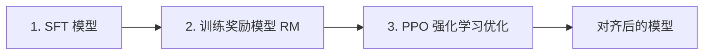

# 37 RLHF 对齐

SFT 教会模型"回答问题"，但不能保证回答**安全、有帮助、诚实**。RLHF（Reinforcement Learning from Human Feedback）通过人类偏好来"对齐"模型行为——这是 ChatGPT 成功的关键一步。

## 为什么需要对齐

SFT 后的模型仍有问题：

- **幻觉**：自信地编造事实
- **有害内容**：可能生成歧视、暴力内容
- **冗长**：回答过于啰嗦
- **不听指令**：不遵守格式要求

对齐的目标：**HHH 原则**——Helpful（有帮助）、Harmless（无害）、Honest（诚实）。

## RLHF 完整流程


RLHF 分三步：



### 步骤 1：SFT（已有）

在高质量指令数据上微调，得到初始策略模型 $\pi_{SFT}$。

### 步骤 2：训练奖励模型（Reward Model）

对同一个 Prompt，让 SFT 模型生成多个回答，人类标注偏好：

```text
Prompt: "解释量子计算"

回答 A: "量子计算利用量子力学原理..."
回答 B: "量子计算就是很快的计算机..."

人类偏好: A > B
```

奖励模型学习预测人类偏好：

$$\mathcal{L}_{RM} = -\log\sigma(r_\theta(x, y_w) - r_\theta(x, y_l))$$

其中 $y_w$ 是被偏好的回答，$y_l$ 是不被偏好的。

```python
from transformers import AutoModelForSequenceClassification

# 奖励模型 = 带标量输出头的 LLM
rm_model = AutoModelForSequenceClassification.from_pretrained(
    "Qwen/Qwen2.5-1.5B",
    num_labels=1,  # 输出一个标量奖励值
)
```

### 步骤 3：PPO 强化学习

用奖励模型的分数作为奖励信号，通过 PPO 算法优化策略模型：

$$\mathcal{L}_{PPO} = \mathbb{E}\left[\min\left(\frac{\pi_\theta}{\pi_{\text{old}}} A, \text{clip}\left(\frac{\pi_\theta}{\pi_{\text{old}}}, 1-\epsilon, 1+\epsilon\right) A\right)\right]$$

其中 $A$ 是优势函数，$\epsilon$ 是裁剪参数。

PPO 的关键约束：**KL 散度惩罚**——防止新策略偏离 SFT 模型太远。

$$R_{\text{total}} = R_{\text{RM}} - \beta \cdot D_{KL}(\pi_\theta \| \pi_{SFT})$$

## DPO（Direct Preference Optimization）


PPO 训练复杂、不稳定。DPO（Rafailov et al., 2023）提出了一个优雅的替代方案：**直接从偏好数据优化策略，不需要奖励模型**。

### 核心思想

DPO 证明了一个关键等式：最优策略和奖励模型之间存在解析关系。因此可以跳过 RM 训练，直接优化：

$$\mathcal{L}_{DPO} = -\log\sigma\left(\beta\log\frac{\pi_\theta(y_w|x)}{\pi_{\text{ref}}(y_w|x)} - \beta\log\frac{\pi_\theta(y_l|x)}{\pi_{\text{ref}}(y_l|x)}\right)$$

直觉：**增大好回答的概率，减小坏回答的概率**，同时参考模型约束不偏离太远。

### DPO 实战

```python
from trl import DPOTrainer, DPOConfig

# DPO 数据格式
dpo_dataset = [
    {
        "prompt": "什么是机器学习？",
        "chosen": "机器学习是人工智能的分支，通过数据自动学习规律...",
        "rejected": "机器学习就是让电脑自己学习，很简单。",
    },
]

# DPO 配置
dpo_config = DPOConfig(
    output_dir="output/dpo",
    num_train_epochs=1,
    per_device_train_batch_size=2,
    learning_rate=5e-7,      # DPO 学习率要小
    beta=0.1,                 # KL 惩罚系数
    gradient_accumulation_steps=8,
    bf16=True,
    logging_steps=10,
)

# 训练
trainer = DPOTrainer(
    model=model,
    ref_model=ref_model,      # 参考模型（冻结的 SFT 模型）
    args=dpo_config,
    train_dataset=dpo_dataset,
    tokenizer=tokenizer,
)
trainer.train()
```

### RLHF vs DPO

| | RLHF (PPO) | DPO |
|---|-----------|-----|
| 需要奖励模型 | ✅ 是 | ❌ 否 |
| 训练复杂度 | 高（4 个模型） | 低（2 个模型） |
| 训练稳定性 | 较差 | 较好 |
| 超参数敏感 | 高 | 低 |
| 效果 | 上限更高 | 够用 |
| 主流使用 | OpenAI | Meta、开源社区 |

## 其他对齐方法

| 方法 | 核心思想 |
|------|---------|
| KTO | 只需要"好/坏"标签，不需要配对 |
| ORPO | 把 SFT 和对齐合并为一步 |
| SimPO | 简化 DPO，不需要参考模型 |
| RLAIF | 用 AI 代替人类做偏好标注 |

## LLaMA-Factory 实战

LLaMA-Factory 是一站式微调框架，支持 SFT、DPO、RLHF：

```bash
# 安装
git clone https://github.com/hiyouga/LLaMA-Factory.git
cd LLaMA-Factory
pip install -e .

# DPO 训练
llamafactory-cli train \
    --model_name_or_path Qwen/Qwen2.5-1.5B \
    --stage dpo \
    --dataset dpo_zh_demo \
    --template qwen \
    --finetuning_type lora \
    --lora_rank 8 \
    --output_dir output_dpo \
    --per_device_train_batch_size 2 \
    --num_train_epochs 1 \
    --learning_rate 5e-7 \
    --bf16 true
```

## 常见误区

1. **DPO 完全替代 RLHF**：PPO 在某些场景上限更高（如推理任务）
2. **忽略数据质量**：偏好数据的质量直接决定对齐效果
3. **beta 设太大**：模型太保守，不敢回答
4. **beta 设太小**：模型"投机取巧"，学不到真正偏好
5. **只做一次对齐**：实践中需要多轮迭代（数据飞轮）

## 小结

| 概念 | 说明 |
|------|------|
| RLHF | 用人类偏好训练奖励模型，再用 PPO 优化 |
| DPO | 直接从偏好数据优化，不需要奖励模型 |
| HHH | Helpful、Harmless、Honest |
| KL 惩罚 | 防止策略偏离太远 |
| LLaMA-Factory | 一站式微调框架，支持 SFT/DPO/RLHF |

## 进一步阅读

1. **Ouyang et al., 2022.** *Training language models to follow instructions with human feedback.* [arXiv:2203.02155](https://arxiv.org/abs/2203.02155) — InstructGPT / RLHF
2. **Rafailov et al., 2023.** *Direct Preference Optimization: Your Language Model is Secretly a Reward Model.* [arXiv:2305.18290](https://arxiv.org/abs/2305.18290) — DPO
3. **Ethayarajh et al., 2024.** *KTO: Model Alignment as Prospect Theoretic Optimization.* [arXiv:2402.01306](https://arxiv.org/abs/2402.01306)
4. **LLaMA-Factory.** [GitHub](https://github.com/hiyouga/LLaMA-Factory)
