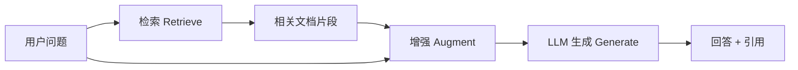

# 38 RAG

RAG（Retrieval-Augmented Generation，检索增强生成）是让 LLM **"开卷考试"** 的技术——先从外部知识库检索相关信息，再让模型基于检索结果生成回答。这是当前 LLM 应用最主流的架构。

## LLM 的知识局限

| 问题 | 说明 | RAG 如何解决 |
|------|------|------------|
| 知识截断 | 训练数据有截止日期 | 实时检索最新信息 |
| 幻觉 | 编造不存在的事实 | 基于检索到的真实文档回答 |
| 私有数据 | 不知道公司内部文档 | 接入企业知识库 |
| 可追溯性 | 无法给出信息来源 | 引用具体文档片段 |

## RAG 基本原理




三步流程：

1. **Retrieve（检索）**：从知识库中找到与问题相关的文档片段
2. **Augment（增强）**：把检索结果和问题拼接成 Prompt
3. **Generate（生成）**：LLM 基于增强后的 Prompt 生成回答

## Embedding 模型

检索的第一步是把文本转为向量（Embedding），才能做语义搜索。

### 常用 Embedding 模型

| 模型 | 维度 | 特点 |
|------|------|------|
| text-embedding-3-small | 1536 | OpenAI，性价比高 |
| BGE-M3 | 1024 | 中文优秀，开源 |
| GTE-Qwen2 | 768-1536 | 阿里，多语言 |
| Jina-embeddings-v3 | 1024 | 多语言，长文本 |

```python
from sentence_transformers import SentenceTransformer

# 加载 Embedding 模型
model = SentenceTransformer("BAAI/bge-m3")

# 编码
texts = ["什么是机器学习？", "机器学习是AI的分支"]
embeddings = model.encode(texts)
print(embeddings.shape)  # (2, 1024)

# 计算相似度
from numpy.linalg import norm
cos_sim = embeddings[0] @ embeddings[1] / (norm(embeddings[0]) * norm(embeddings[1]))
print(f"余弦相似度: {cos_sim:.4f}")
```

## 向量数据库

向量数据库专门用于存储和检索高维向量。

### 主流向量数据库

| 数据库 | 特点 | 适用场景 |
|--------|------|---------|
| FAISS | Facebook 出品，纯库 | 本地实验 |
| Chroma | 轻量、嵌入式 | 快速原型 |
| Milvus | 分布式、生产级 | 大规模部署 |
| Weaviate | GraphQL API | 云服务 |
| Qdrant | Rust 实现，高性能 | 高性能场景 |

### Chroma 实战

```python
import chromadb

# 创建/加载数据库
client = chromadb.PersistentClient(path="./chroma_db")
collection = client.get_or_create_collection(
    name="my_docs",
    metadata={"hnsw:space": "cosine"},  # 使用余弦相似度
)

# 添加文档
collection.add(
    documents=["机器学习是AI的分支", "深度学习是机器学习的子集"],
    ids=["doc1", "doc2"],
    metadatas=[{"source": "wiki"}, {"source": "textbook"}],
)

# 检索
results = collection.query(
    query_texts=["什么是深度学习？"],
    n_results=3,
)
print(results["documents"])
```

## 文档分块策略

长文档需要切分成小块（Chunk）才能有效检索。

| 策略 | 说明 | 适用场景 |
|------|------|---------|
| 固定长度 | 每 512 Token 一块 | 通用 |
| 递归分块 | 按段落→句子→字符递归 | 结构化文档 |
| 语义分块 | 按语义边界切分 | 高质量需求 |
| 按标题 | 按 Markdown 标题切分 | 技术文档 |

```python
from langchain.text_splitter import RecursiveCharacterTextSplitter

splitter = RecursiveCharacterTextSplitter(
    chunk_size=500,
    chunk_overlap=50,  # 重叠部分，保证上下文连续
    separators=["\n\n", "\n", "。", "！", "？", " "],
)

chunks = splitter.split_text(long_document)
```

## 检索方法

| 方法 | 原理 | 优缺点 |
|------|------|--------|
| Dense Retrieval | 语义相似度（Embedding） | 语义强，但可能漏掉关键词匹配 |
| Sparse Retrieval | 关键词匹配（BM25） | 精确匹配强，但语义弱 |
| Hybrid | Dense + Sparse 结合 | 最佳实践 |

```python
from langchain.retrievers import EnsembleRetriever
from langchain.retrievers import BM25Retriever

# BM25 检索器
bm25_retriever = BM25Retriever.from_texts(texts)
bm25_retriever.k = 3

# 向量检索器
vector_retriever = chroma.as_retriever(search_kwargs={"k": 3})

# 混合检索
ensemble = EnsembleRetriever(
    retrievers=[bm25_retriever, vector_retriever],
    weights=[0.3, 0.7],  # BM25:30%, Dense:70%
)
```

## 用 LangChain 搭建完整 RAG

```python
from langchain_openai import ChatOpenAI, OpenAIEmbeddings
from langchain_chroma import Chroma
from langchain.chains import RetrievalQA

# 1. 准备向量数据库
embeddings = OpenAIEmbeddings()
vectorstore = Chroma(persist_directory="./chroma_db", embedding_function=embeddings)

# 2. 创建检索器
retriever = vectorstore.as_retriever(search_kwargs={"k": 5})

# 3. 创建 LLM
llm = ChatOpenAI(model="gpt-4o-mini", temperature=0)

# 4. 创建 RAG 链
qa_chain = RetrievalQA.from_chain_type(
    llm=llm,
    retriever=retriever,
    return_source_documents=True,
)

# 5. 提问
result = qa_chain.invoke({"query": "什么是机器学习？"})
print(result["result"])
for doc in result["source_documents"]:
    print(f"来源: {doc.metadata['source']}")
```

## RAG 评估

| 指标 | 含义 | 评估方式 |
|------|------|---------|
| Faithfulness | 回答是否基于检索内容 | LLM 评估 |
| Relevancy | 回答是否切题 | LLM 评估 |
| Context Precision | 检索结果是否精确 | 人工/LLM |
| Context Recall | 是否检索到所有相关信息 | 人工 |

```python
# 用 RAGAS 评估
from ragas import evaluate
from ragas.metrics import faithfulness, answer_relevancy

result = evaluate(
    dataset=eval_dataset,
    metrics=[faithfulness, answer_relevancy],
)
```

## 高级 RAG 技巧

### 句子窗口检索

先检索句子，返回时扩展到上下文窗口：

```text
检索命中: "深度学习使用多层神经网络。"
返回窗口: "...机器学习的一个分支是深度学习。深度学习使用多层神经网络。这种方法在图像识别领域取得了突破性进展。..."
```

### Query Rewriting

用 LLM 改写用户问题，提高检索质量：

```python
# 原始问题："这玩意儿咋用？"
# 改写后："如何使用这个产品？请提供详细的操作步骤。"
```

### Re-ranking

对检索结果重新排序（Cross-Encoder 比 Bi-Encoder 更准）：

```python
from sentence_transformers import CrossEncoder

reranker = CrossEncoder("BAAI/bge-reranker-v2-m3")
pairs = [[query, doc] for doc in retrieved_docs]
scores = reranker.predict(pairs)
# 按分数重新排序
```

## 常见误区

1. **只用 Dense Retrieval**：Hybrid（Dense + BM25）效果更好
2. **Chunk 太大**：500 Token 是好的起点，太大会稀释相关信息
3. **Chunk 太小**：失去上下文，语义不完整
4. **不做 Re-ranking**：Top-k 检索的结果质量参差不齐
5. **忽略评估**：不量化就不知道 RAG 是否真的有用

## 小结

| 概念 | 说明 |
|------|------|
| RAG | 检索增强生成，LLM 的"开卷考试" |
| Embedding | 文本→向量，语义搜索的基础 |
| 向量数据库 | 存储和检索向量（FAISS/Chroma/Milvus） |
| 分块策略 | 固定长度/递归/语义/按标题 |
| 混合检索 | Dense + Sparse（BM25） |
| Re-ranking | Cross-Encoder 重新排序 |

## 进一步阅读

1. **Lewis et al., 2020.** *Retrieval-Augmented Generation for Knowledge-Intensive NLP Tasks.* [arXiv:2005.11401](https://arxiv.org/abs/2005.11401) — RAG 原始论文
2. **Gao et al., 2023.** *Retrieval-Augmented Generation for Large Language Models: A Survey.* [arXiv:2312.10997](https://arxiv.org/abs/2312.10997)
3. **LangChain 文档.** [link](https://python.langchain.com/)
4. **RAGAS 评估框架.** [GitHub](https://github.com/explodinggradients/ragas)
