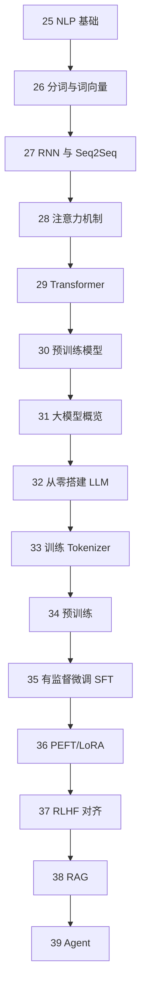

# 第三篇：大语言模型

从 NLP 基础到 Transformer，从预训练到 RAG/Agent——完整覆盖 LLM 技术栈。

本篇是整个教程的**最终目标篇**。基础篇（1-10 章）帮你打好数学和经典 ML 基础，进阶篇（11-24 章）带你掌握深度学习和生成模型，而本篇将带你**从零理解并动手实现大语言模型**。

## 学习路线

## 章节导航

<Cards>
  <Card title="25 NLP 基础" href="/docs/llm/25-nlp-foundations">
    NLP 定义、发展历程、任务分类、文本表示演进
  </Card>
  <Card title="26 分词与词向量" href="/docs/llm/26-tokenization-wordvec">
    BPE、WordPiece、Word2Vec、Gensim
  </Card>
  <Card title="27 RNN 与 Seq2Seq" href="/docs/llm/27-rnn-seq2seq">
    RNN/LSTM 回顾、编码器-解码器、信息瓶颈
  </Card>
  <Card title="28 注意力机制" href="/docs/llm/28-attention-mechanism">
    Scaled Dot-Product、多头注意力、掩码注意力
  </Card>
  <Card title="29 Transformer" href="/docs/llm/29-transformer">
    完整架构、位置编码、从零搭建
  </Card>
  <Card title="30 预训练模型" href="/docs/llm/30-pretrained-models">
    BERT、GPT、T5、HuggingFace 生态
  </Card>
  <Card title="31 大模型概览" href="/docs/llm/31-llm-overview">
    规模定律、涌现能力、训练三阶段
  </Card>
  <Card title="32 从零搭建 LLM" href="/docs/llm/32-build-llm-from-scratch">
    LLaMA2 全组件、MoE、生成策略
  </Card>
  <Card title="33 训练 Tokenizer" href="/docs/llm/33-tokenizer-training">
    BPE/SentencePiece 实战
  </Card>
  <Card title="34 预训练" href="/docs/llm/34-pretraining">
    数据处理、分布式训练、DeepSpeed
  </Card>
  <Card title="35 有监督微调 SFT" href="/docs/llm/35-sft">
    指令微调、数据格式、训练流程
  </Card>
  <Card title="36 PEFT/LoRA" href="/docs/llm/36-peft-lora">
    LoRA、QLoRA、模型量化
  </Card>
  <Card title="37 RLHF 对齐" href="/docs/llm/37-rlhf-alignment">
    RLHF、DPO、LLaMA-Factory
  </Card>
  <Card title="38 RAG" href="/docs/llm/38-rag">
    检索增强生成、向量数据库、高级 RAG
  </Card>
  <Card title="39 Agent" href="/docs/llm/39-agent">
    ReAct、Function Calling、LangChain、MCP
  </Card>
</Cards>
